# MercaIntelligence


[](https://mercaintelligence.pages.dev/)

**Plataforma de inteligencia de precios sobre el catálogo de Mercadona con scraping diario, ML/DL, NLP y visualización en tiempo real.**

🌐 **Demo en vivo:** [https://mercaintelligence.pages.dev/](https://mercaintelligence.pages.dev/)

---

## 📋 Descripción

MercaIntelligence es un sistema integral de monitorización, análisis y predicción de precios del catálogo online de Mercadona. El proyecto aborda un problema real del consumidor y del analista de retail: la falta de herramientas automatizadas para rastrear la evolución de más de 5.000 productos a lo largo del tiempo, detectar anomalías en precios, identificar equivalencias entre marcas propias y comerciales, y anticipar cambios futuros.

El sistema ingiere diariamente los datos de un scraper externo ejecutado mediante GitHub Actions, los procesa a través de un pipeline ETL incremental que genera un Data Lake en formato Parquet particionado por fecha, y los indexa en Elasticsearch para su exploración visual en Kibana. Sobre esta base de datos se ejecutan módulos de Machine Learning y Deep Learning que incluyen detección de anomalías con tres enfoques complementarios (Z-Score, Isolation Forest y Autoencoder LSTM), un clasificador LSTM para predecir cambios de precio a 7 días, un regresor XGBoost que estima el precio futuro, y un pipeline NLP basado en sentence-transformers que empareja automáticamente productos de marca propia con sus equivalentes comerciales.

En la práctica, la ingesta diaria no debe depender de un watcher sobre una ruta remota. En GitHub Actions lo robusto es pasar el CSV generado al script con `--csv` o apuntar a la carpeta del checkout con `--input-dir`; `--watch` queda reservado para máquinas o runners locales y persistentes.

El frontend en Vue 3 permite al usuario construir cestas de la compra personalizadas, calcular un IPC personalizado ponderado por consumo real, visualizar predicciones de coste futuro, consultar alertas de anomalías y shrinkflation, y explorar las equivalencias de marca con su brecha de precio. Todo el stack se despliega con Docker Compose en cuatro servicios independientes (Elasticsearch, Kibana, API Flask y Frontend Nginx).

El valor diferencial del proyecto reside en la convergencia inter-modular: tres modelos independientes (LSTM, XGBoost y Autoencoder) validan mutuamente sus hallazgos, el LSTM alimenta al XGBoost como feature, y la degradación temporal del XGBoost coincide exactamente con los picos de anomalías del Autoencoder, confirmando que los cambios detectados son genuinos.

---

## 🏗️ Arquitectura

```
┌─────────────────┐     ┌──────────────────────┐     ┌─────────────────────────┐
│  Scraper Diario  │────▶│   CSV diario (raw/)  │────▶│ ingesta_incremental.py  │
│ (GitHub Actions) │     └──────────────────────┘     │  Limpieza + Features    │
└─────────────────┘                                   └───────────┬─────────────┘
                                                                  │
                                              ┌───────────────────┼──────────────────┐
                                              ▼                   ▼                  ▼
                                   ┌──────────────────┐ ┌──────────────┐ ┌──────────────────┐
                                   │ Parquet Particio- │ │ Elasticsearch│ │ ultimo_precio    │
                                   │ nado (processed/) │ │ (9200)       │ │ (state/)         │
                                   └────────┬─────────┘ └──────┬───────┘ └──────────────────┘
                                            │                  │
                              ┌─────────────┼──────────┐       │
                              ▼             ▼          ▼       ▼
                     ┌──────────────┐ ┌──────────┐ ┌────────┐ ┌────────┐
                     │ Anomalías    │ │ LSTM     │ │XGBoost │ │ NLP    │
                     │ ZS + IF + AE │ │Clasific. │ │Predic. │ │Embedds.│
                     └──────┬───────┘ └────┬─────┘ └───┬────┘ └───┬────┘
                            │              │           │          │
                            └──────────────┴─────┬─────┴──────────┘
                                                 ▼
                                        ┌────────────────┐
                                        │  API Flask     │
                                        │  (puerto 5000) │
                                        └───────┬────────┘
                                                │
                                  ┌─────────────┼──────────────┐
                                  ▼                            ▼
                         ┌────────────────┐          ┌─────────────────┐
                         │ Frontend Vue 3 │          │ Kibana          │
                         │ (puerto 80)    │          │ (puerto 5601)   │
                         └────────────────┘          └─────────────────┘
```

---

## 🧠 Módulos de Machine Learning

| Módulo | Técnica | Archivo | Output |
|--------|---------|---------|--------|
| Anomalías (baseline) | Z-Score Rolling (14d, 2.5σ) | `src/ml/anomalias_zscore.py` | `data/anomalias/zscore_resultados.parquet` |
| Anomalías (ML) | Isolation Forest (200 árboles, contam=0.5%) | `src/ml/anomalias_isolation_forest.py` | `data/anomalias/if_resultados.parquet` + `models/isolation_forest.pkl` |
| Anomalías (DL) | Autoencoder LSTM (ventana=14d, P99) | `src/ml/anomalias_autoencoder.py` | `data/anomalias/ae_resultados.parquet` + `models/autoencoder_lstm.keras` |
| Predicción cambio | LSTM Clasificador binario (14d → 7d) | `notebooks/lstm_clasificador_colab.ipynb` | `data/predicciones/lstm/lstm_resultados.parquet` + `models/lstm_clasificador.keras` |
| Predicción precio | XGBoost Regresor (21 features, horizonte 7d) | `src/ml/xgboost_prediccion.py` | `models/xgboost_precio.pkl` + `models/xgboost_encoders.pkl` |
| Equivalencias NLP | sentence-transformers + similitud coseno | `src/ml/nlp_embeddings.py` | `data/nlp/equivalencias.parquet` |
| Segmentación | K-Means (K=5, 7 features, PCA) | `notebooks/clustering_kmeans.ipynb` | `data/clustering/` |
| Shrinkflation | Detección por correlación precio/medida | `src/etl/detector_shrinkflation.py` | `data/shrinkflation/alertas.parquet` |
| Rotación catálogo | Altas/bajas con burn-in y confirmación | `src/etl/detector_catalogo.py` | `data/catalogo/nuevos.parquet` + `descatalogados.parquet` |

---

## 🛠️ Stack tecnológico

| Backend | Frontend / Infraestructura |
|---------|---------------------------|
| Python 3.11 | Vue 3 + Composition API |
| pandas + PyArrow | Vite |
| Elasticsearch 7.17 | ECharts (visualizaciones) |
| Flask + Flask-CORS | Axios (HTTP client) |
| TensorFlow / Keras | Nginx (proxy inverso) |
| XGBoost | Docker + Docker Compose |
| scikit-learn | Kibana 7.17 |
| sentence-transformers (paraphrase-multilingual-MiniLM-L12-v2) | pnpm (gestor de paquetes) |
| NumPy | GitHub Actions (scraper) |
| watchdog (vigilancia de ficheros) | Google Colab (entrenamiento GPU) |

---

## 📁 Estructura del proyecto

```
mercaintelligence/
├── data/                          # Data Lake del proyecto
│   ├── raw/                       # CSVs diarios originales del scraper
│   ├── processed/                 # Parquet particionado por fecha (fecha=YYYY-MM-DD/)
│   ├── state/                     # Estado transaccional (ultimo_precio.parquet)
│   ├── anomalias/                 # Resultados de los 3 detectores de anomalías
│   ├── predicciones/              # Predicciones LSTM y XGBoost
│   ├── nlp/                       # Equivalencias semánticas marca propia ↔ comercial
│   ├── clustering/                # Resultados de segmentación K-Means
│   ├── catalogo/                  # Productos nuevos y descatalogados
│   └── shrinkflation/             # Alertas de reduflación
├── models/                        # Modelos entrenados (.pkl y .keras) — vía Git LFS
│   ├── autoencoder_lstm.keras         # Autoencoder LSTM (detección anomalías DL)
│   ├── lstm_clasificador.keras        # LSTM clasificador (predicción cambio precio)
│   ├── isolation_forest.pkl           # Isolation Forest (detección anomalías ML)
│   ├── xgboost_precio.pkl             # XGBoost regresor de precio futuro
│   ├── xgboost_encoders.pkl           # Encoders de categorías para XGBoost
│   ├── lstm_scaler.pkl                # Scaler de entrada del LSTM
│   └── ae_umbral.pkl                  # Umbral P99 del Autoencoder (reconstrucción)
├── src/
│   ├── etl/                       # Pipeline ETL: ingesta, consolidación, indexación
│   │   ├── consolidar_historico.py        # Construcción inicial del parquet maestro
│   │   ├── ingesta_incremental.py         # Ingesta diaria con watchdog
│   │   ├── master_ingest.py               # Orquestador maestro de indexación en ES
│   │   ├── detector_catalogo.py           # Detección de altas y bajas del surtido
│   │   ├── detector_shrinkflation.py      # Detección de reduflación
│   │   ├── es_utils.py                    # Utilidades de conexión a Elasticsearch
│   │   ├── indexar_historico_es.py         # Indexación del histórico en ES
│   │   ├── indexar_anomalias_es.py        # Enriquecimiento de ES con scores de anomalía
│   │   ├── indexar_equivalencias_es.py    # Indexación de equivalencias NLP en ES
│   │   ├── indexar_ipc_es.py              # Indexación de series IPC en ES
│   │   └── migrar_a_particionado.py       # Migración de monolítico a particionado
│   ├── ml/                        # Modelos de Machine Learning y Deep Learning
│   │   ├── anomalias_zscore.py            # Detector Z-Score Rolling
│   │   ├── anomalias_isolation_forest.py  # Detector Isolation Forest
│   │   ├── anomalias_autoencoder.py       # Autoencoder LSTM (inferencia local)
│   │   ├── nlp_embeddings.py              # Pipeline NLP de equivalencias semánticas
│   │   └── xgboost_prediccion.py          # Regresor XGBoost de precio futuro
│   └── api/
│       └── app.py                 # API Flask con todos los endpoints
├── frontend/                      # Aplicación Vue 3 + Vite
│   └── src/
│       ├── views/                 # Vistas: Home, IPC, Anomalías, Buscador, Marcas, etc.
│       ├── services/api.js        # Capa de abstracción para llamadas a la API
│       ├── components/            # Componentes Vue reutilizables
│       └── router/                # Enrutamiento SPA
├── notebooks/                     # Notebooks de entrenamiento y análisis
├── docs/                          # Documentación y análisis detallados
│   └── analisis/                  # Documentos de análisis por módulo
├── dashboards/                    # Exportación de dashboards Kibana (NDJSON)
├── docker-compose.yml             # Orquestación de 4 servicios
├── Dockerfile.api                 # Imagen de la API Flask
├── Dockerfile.frontend            # Multi-stage build: Node → Nginx
├── nginx.conf                     # Configuración de proxy inverso
└── requirements.txt               # Dependencias Python
```

---

## 🧮 IPC personalizado — Metodología

El IPC personalizado es una de las funcionalidades centrales del sistema. A diferencia del IPC oficial (que pondera por consumo agregado de la población), MercaIntelligence permite al usuario construir una cesta con productos específicos y cantidades mensuales reales, calculando un índice ponderado por su consumo personal:

1. **Fecha base**: primera fecha disponible del dataset (2025-11-03)
2. **Pesos automáticos**: `gasto_i = precio_base_i × cantidad_mensual_i` → `peso_i = gasto_i / gasto_total`
3. **Índice por producto**: `índice_t = precio_t / precio_base × 100`
4. **IPC de la cesta**: `IPC(t) = Σ [ peso_i × índice_i(t) ]`

El sistema incluye 6 perfiles predefinidos (familiar, estudiante, vegano, deportista, pareja y una cesta personal del autor) con productos y cantidades reales. La predicción de coste futuro combina la probabilidad de cambio del LSTM con la tendencia histórica de cada producto.

---

## 🚀 Instalación y uso

### 🌐 Demo en vivo

El frontend está desplegado y listo para probar en:  
👉 **[https://mercaintelligence.pages.dev/](https://mercaintelligence.pages.dev/)**

---

### Opción A — Docker (recomendado)

```bash
git clone https://github.com/DanielPMdev/mercaintelligence.git
cd mercaintelligence
git lfs pull          # descarga los modelos binarios (Git LFS)
docker-compose up -d
```

> ⚠️ **Nota de portabilidad en Docker:** El archivo `docker-compose.yml` está preconfigurado con rutas absolutas de volumen (`/e/Dockers/ElasticSearch/...`) del disco del autor para persistir los datos de Elasticsearch y Kibana. Para levantarlo en tu sistema sin errores de montaje, edita `docker-compose.yml` y ajusta estas rutas o bien descomenta las líneas alternativas con rutas relativas (`./.docker-data/...`).

| Servicio | URL | Descripción |
|----------|-----|-------------|
| Frontend | [http://localhost](http://localhost) | Interfaz de usuario Vue 3 |
| API Flask | [http://localhost:5000](http://localhost:5000) | Endpoints REST |
| Kibana | [http://localhost:5601](http://localhost:5601) | Dashboards de exploración |
| Elasticsearch | [http://localhost:9200](http://localhost:9200) | Motor de búsqueda e indexación |

### Opción B — Desarrollo local

> ⚠️ **Modelos binarios (Git LFS):** el repositorio usa [Git LFS](https://git-lfs.com/) para almacenar los modelos `.keras` y `.pkl`. Si `git clone` no los descarga automáticamente, ejecuta `git lfs pull` dentro del directorio clonado.

```bash
# 1. Clonar y crear entorno
git clone https://github.com/DanielPMdev/mercaintelligence.git
cd mercaintelligence
git lfs pull          # descarga autoencoder_lstm.keras, lstm_clasificador.keras, etc.
python -m venv .venv
.venv\Scripts\activate       # Windows
# source .venv/bin/activate  # Linux/macOS

# 2. Instalar dependencias Python
pip install -r requirements.txt

# 3. Consolidar histórico (solo la primera vez)
python src/etl/consolidar_historico.py

# 4. Levantar Elasticsearch y Kibana
docker-compose up -d es01 kibana

# 5. Indexar histórico y anomalías en Elasticsearch
python src/etl/master_ingest.py

# 6. Lanzar la API Flask
python src/api/app.py

# 7. Lanzar el frontend (en otra terminal)
cd frontend
pnpm install
pnpm dev
```

---

## 📊 Resultados obtenidos

| Módulo | Métrica | Resultado |
|--------|---------|-----------|
| Z-Score (14d, 2.5σ) | Tasa de anomalía | 0.50% · 3,813 alertas · 1,683 productos |
| Isolation Forest | Tasa de anomalía | 0.50% · 3,818 alertas · 59 productos |
| Autoencoder LSTM | Tasa de anomalía | 1.00% · 6,929 alertas · 1,300 productos |
| Jaccard ZS ↔ IF ↔ AE | Solapamiento entre métodos | 0.006 / 0.000 / 0.005 — métodos complementarios |
| LSTM clasificador | AUC-ROC en test | 0.893 vs 0.771 baseline LR |
| XGBoost regresor | MAPE en cambios reales | 10.75% vs 11.22% baseline naive (+4.2% mejora) |
| NLP sentence-transformers | Similitud media | 0.844 · 924 equivalencias · brecha mediana +49.0% |
| K-Means | Silhouette Score (K=5) | 0.441 · 76.0% varianza PCA 2D |
| Shrinkflation | Casos detectados | 20 alertas · 100% producto fresco · severidad media 12.49 |
| Catálogo | Rotación detectada | 615 nuevos · 717 descatalogados · pico marzo (+157) |

> Ver análisis detallados por módulo en [`docs/analisis/`](docs/analisis/).

### Detección de anomalías

| Método | Evaluadas | Anomalías | Tasa | Productos afectados | Jaccard vs ZS | Jaccard vs IF |
|--------|-----------|-----------|------|---------------------|---------------|---------------|
| Z-Score Rolling (14d, 2.5σ) | 763,435 | 3,813 | 0.50% | 1,683 | — | — |
| Isolation Forest (200 árboles, contam=0.5%) | 763,435 | 3,818 | 0.50% | 59 | 0.006 | — |
| Autoencoder LSTM (ventana=14d, P99) | 692,816 | 6,929 | 1.00% | 1,300 | 0.000 | 0.005 |

> La complementariedad extrema (Jaccard ≈ 0) confirma que cada método captura una dimensión de anomalía completamente distinta.

<p align="center">
  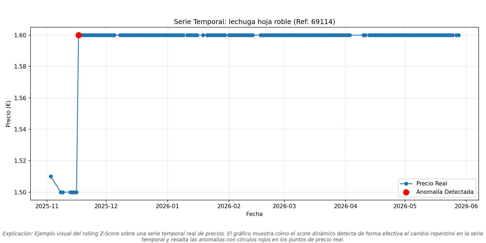
</p>
<p align="center"><em>Ejemplo de detección Z-Score: subida brusca de precio identificada como anomalía (punto rojo) sobre la serie temporal real de un producto.</em></p>

### Predicción de precios

| Métrica | XGBoost | Baseline Naive |
|---------|---------|----------------|
| MAE (€) | 0.1304 | 0.0230 |
| MAPE (%) | 1.29% | 0.46% |
| R² | 0.7993 | 0.9984 |

> El 95.9% de los precios no cambian en 7 días, haciendo que la persistencia sea casi óptima. En el 4.1% con cambio real, XGBoost mejora el MAPE en un +4.2%.

**Walk-forward validation (3 folds expansivos):**

| Fold | Train | Test | MAE (€) | R² | MAPE (%) |
|:----:|------:|-----:|:-------:|:--:|:--------:|
| 1 | 275,940 | 91,086 | 0.0448 | 0.9984 | 0.86% |
| 2 | 367,026 | 90,568 | 0.1110 | 0.8496 | 1.08% |
| 3 | 457,594 | 90,126 | 0.1360 | 0.8042 | 1.36% |
| **Media** | — | — | **0.0973** | **0.8841** | **1.10%** |

> La degradación temporal (R² 0.99 → 0.80) coincide con los picos de anomalías detectados por el Autoencoder en abril-mayo 2026, validando de forma cruzada ambos módulos.

<p align="center">
  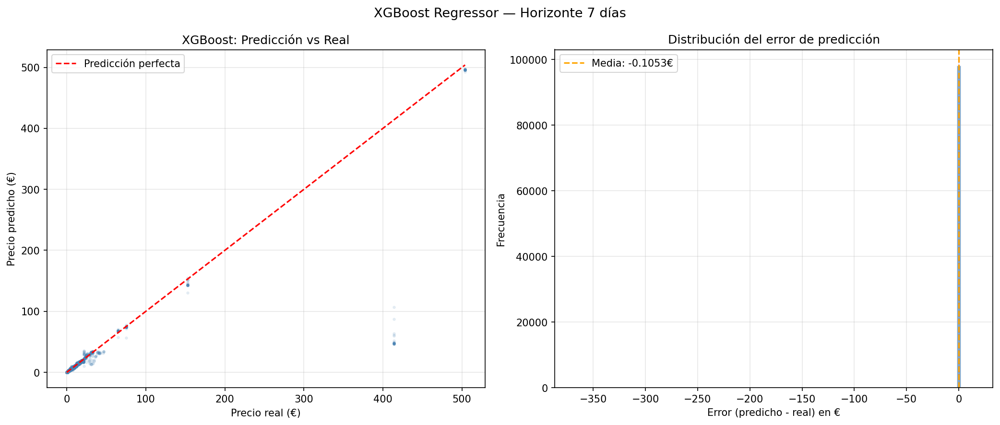
</p>
<p align="center"><em>Dispersión predicción vs precio real (izq.) y distribución del error de predicción en € (dcha.). La mayoría de predicciones se ajustan a la diagonal, con errores notables solo en productos de gama alta (>300€).</em></p>

<p align="center">
  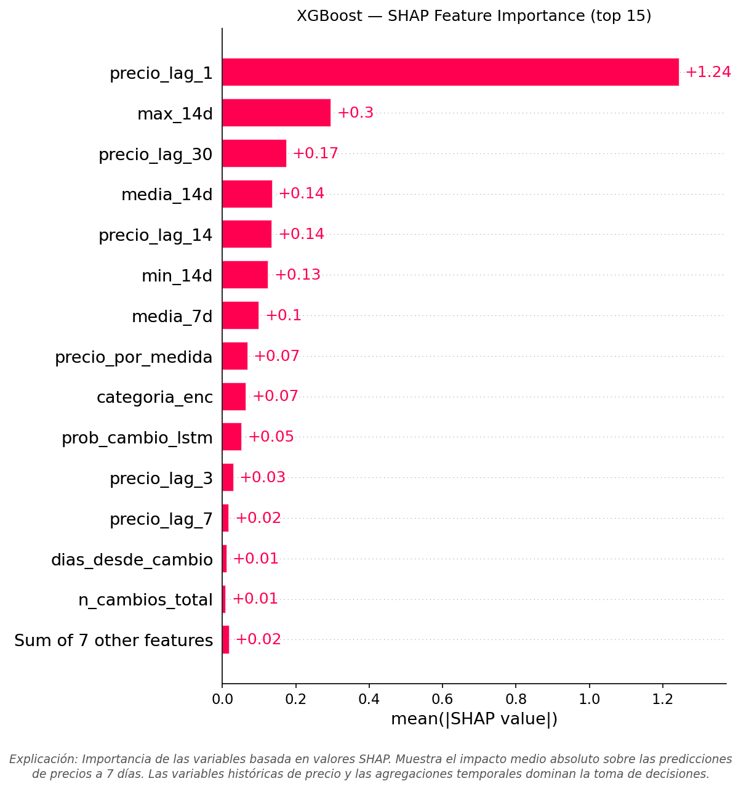
</p>
<p align="center"><em>Importancia SHAP de las 15 features principales. <code>precio_lag_1</code> domina con un impacto medio de +1.24, seguido del máximo a 14 días y lags temporales. Nótese <code>prob_cambio_lstm</code> en el top 11, confirmando la integración inter-modular.</em></p>

### LSTM Clasificador

| Modelo | Precision | Recall | F1-score | AUC-ROC |
|--------|-----------|--------|----------|---------|
| LSTM | 0.207 | 0.624 | 0.311 | **0.893** |
| Regresión Logística (baseline) | 0.156 | 0.279 | 0.201 | 0.771 |

> El LSTM genera 658,373 predicciones históricas cubriendo 4,858 productos, con 31,054 alertas de cambio de precio.

<p align="center">
  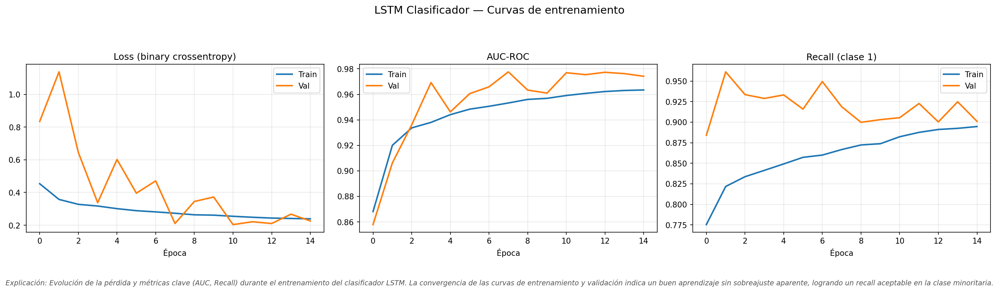
</p>
<p align="center"><em>Curvas de entrenamiento: convergencia de Loss, AUC-ROC (0.98 en validación) y Recall (clase 1) a lo largo de 15 épocas. Early Stopping restauró los pesos de la época 8.</em></p>

<p align="center">
  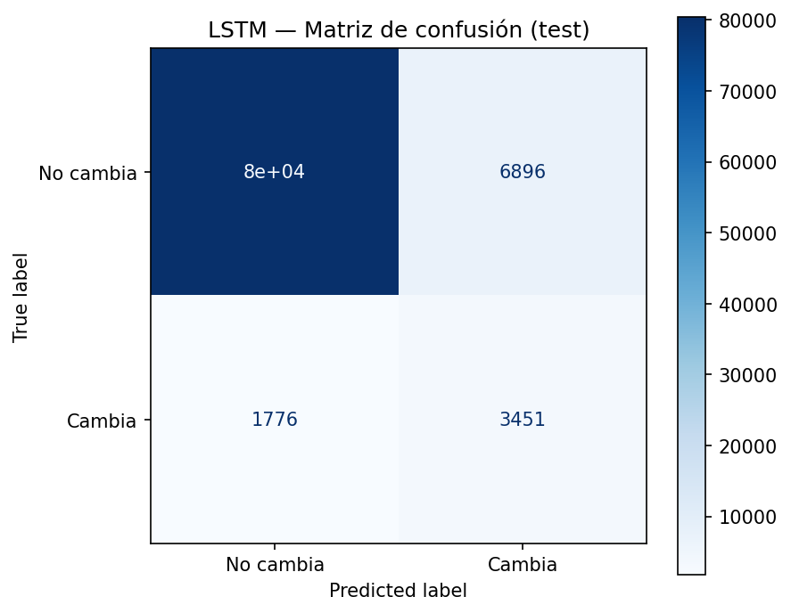
</p>
<p align="center"><em>Matriz de confusión en test: el LSTM detecta 2,745 de los 4,401 cambios reales (Recall 62.4%), generando 10,501 falsos positivos — un trade-off controlado por la optimización del umbral.</em></p>

### Equivalencias NLP

| Métrica | Valor |
|---------|-------|
| Equivalencias top-1 generadas | 924 |
| Similitud media coseno | 0.844 |
| Pares comparables (misma unidad) | 892 |
| **Brecha mediana marca propia vs comercial** | **+49.0%** |

<p align="center">
  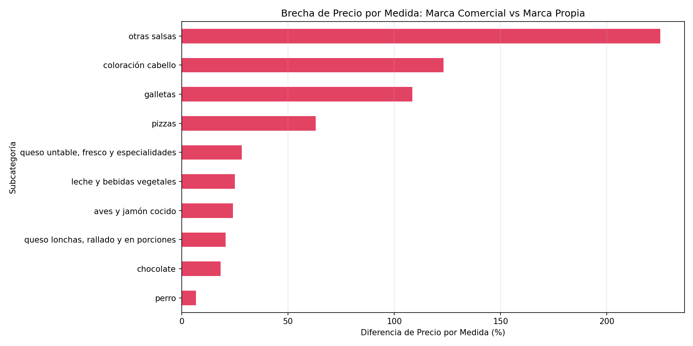
</p>
<p align="center"><em>Brecha de precio por medida (%) entre marca comercial y marca propia en las 10 subcategorías con más pares. Coloración de cabello lidera con +120%, mientras que aceitunas y encurtidos es la única categoría donde la marca propia es más cara.</em></p>

<p align="center">
  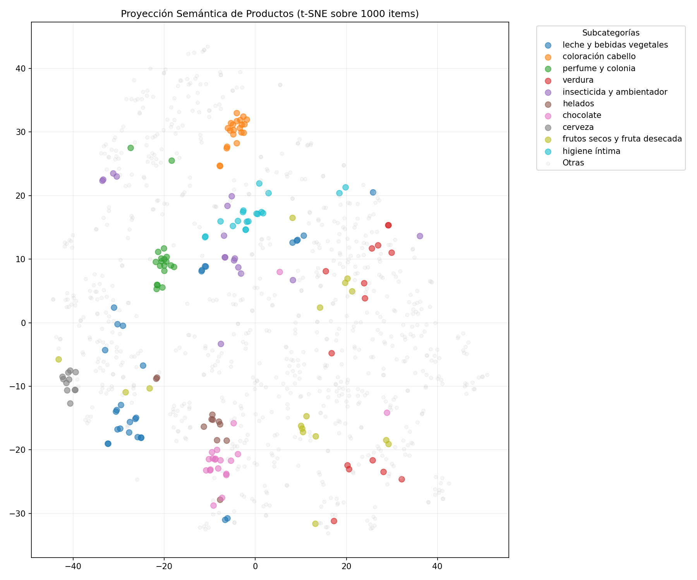
</p>
<p align="center"><em>Proyección t-SNE de los embeddings del catálogo. La agrupación visual por subcategorías (coloración cabello, cerveza, chocolate, perfumería) valida la capacidad del modelo para estructurar categorías semánticas coherentes.</em></p>

### Segmentación K-Means

| Métrica | Valor |
|---------|-------|
| Productos segmentados | 5,049 |
| Clusters (K) | 5 |
| Silhouette Score | 0.441 |
| Varianza explicada PCA (2D) | 76.0% |

**Perfiles de negocio descubiertos:**

| Cluster | Perfil | Productos | Estabilidad | Marca propia | Categorías dominantes |
|:-------:|--------|:---------:|:-----------:|:------------:|----------------------|
| 0 | Estables de Precio Medio | 1,467 | 99.8% | 58.6% | Mixto |
| 1 | Marcas Nacionales en Promoción | 120 | Baja (rango alto) | 10.8% | Cuidado facial, bodega |
| 2 | Básicos Estables de Marca Blanca | 2,942 | 99.8% | 77.4% | Cuidado personal, limpieza |
| 3 | Frescos de Alta Volatilidad | 30 | 41.8% | 0.0% | Fruta/verdura, pescado |
| 4 | Dinámicos de Variabilidad Moderada | 490 | 96.2% | 26.7% | Mixto |

<p align="center">
  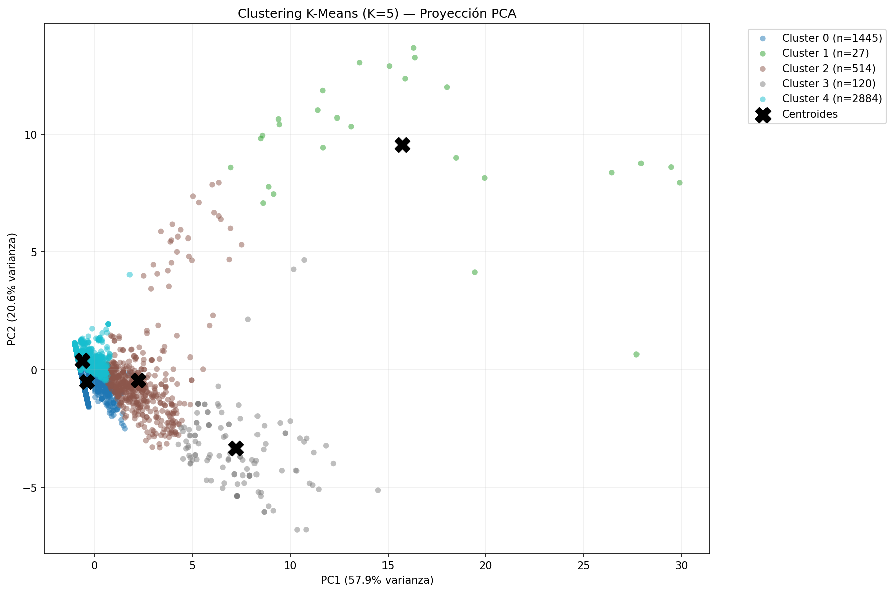
</p>
<p align="center"><em>Proyección PCA bidimensional (78.8% de varianza explicada) mostrando los 5 perfiles. El Cluster 3 (Frescos de Alta Volatilidad, 30 productos) se separa radicalmente del resto, mientras que los Clusters 0 y 2 forman una masa compacta de productos estables.</em></p>

### Rotación del catálogo

| Evento | Cantidad |
|--------|----------|
| Productos nuevos detectados | 615 |
| Productos descatalogados confirmados | 717 |

### Shrinkflation

| Métrica | Valor |
|---------|-------|
| Casos únicos confirmados | 20 |
| Variación media precio absoluto | -0.10% |
| Variación media precio por medida | +12.39% |
| Severidad media | 12.49 |

---

## 🔌 API Reference

| Método + Ruta | Descripción | Parámetros | Campos clave respuesta |
|---------------|-------------|------------|----------------------|
| `GET /api/categorias` | Lista categorías y subcategorías | — | `categorias: {cat: [subcat, ...]}` |
| `GET /api/productos` | Productos filtrados del catálogo | `categoria`, `subcategoria`, `marca`, `q`, `limit` | `total`, `productos: [{referencia, titulo, precio_actual, ...}]` |
| `GET /api/cestas` | Perfiles de cesta predefinidos | — | `perfiles: {familiar: {nombre, descripcion, n_productos, productos}}` |
| `POST /api/ipc` | Calcula IPC ponderado de una cesta | Body: `{productos: [{referencia, cantidad_mensual}]}` o `{perfil: "familiar"}` | `ipc_actual`, `variacion_total`, `fechas`, `ipc_cesta`, `por_producto` |
| `POST /api/ipc/prediccion` | Predicción de coste futuro de la cesta | Body: igual que `/ipc`. Query: `horizonte` (días, max 90) | `coste_actual`, `coste_predicho`, `variacion_esperada`, `desglose` |
| `POST /api/recomendaciones` | Alternativas más baratas (NLP) | Body: igual que `/ipc` | `ahorro_total_mensual`, `n_con_ahorro`, `recomendaciones` |
| `GET /api/equivalencias` | Equivalencias NLP marca propia ↔ comercial | `subcategoria`, `marca`, `min_similitud`, `limit` | `total`, `equivalencias: [{titulo_mp, titulo_com, similitud, diferencia_por_medida_pct}]` |
| `GET /api/anomalias/hoy` | Productos anómalos en la última fecha | `metodo`: `zscore`, `if`, `ae`, `todos` | `fecha`, `resumen: {zscore: N, ...}`, `anomalias` |
| `GET /api/catalogo/eventos` | Productos nuevos y descatalogados | `tipo`: `nuevo`, `descatalogado`, `todos`. `limit` | `nuevos: [{referencia, titulo, primera_fecha}]`, `descatalogados` |
| `GET /api/shrinkflation` | Alertas de shrinkflation | `categoria`, `min_severidad`, `limit` | `total`, `alertas: [{referencia, titulo, severidad, reduccion_pct}]` |
| `GET /api/producto/<referencia>` | Detalle completo de un producto | `referencia` (int, en URL) | `producto`, `historial`, `anomalias`, `equivalencias`, `shrinkflation` |
| `GET /health` | Healthcheck del sistema | — | `status`, `productos`, `fecha_actual`, `predicciones_lstm` |

### Ejemplo de petición

```bash
# Calcular IPC del perfil familiar
curl -X POST http://localhost:5000/api/ipc \
  -H "Content-Type: application/json" \
  -d '{"perfil": "familiar"}'

# Buscar productos por texto
curl "http://localhost:5000/api/productos?q=leche&marca=propia&limit=10"

# Predicción de coste a 30 días
curl -X POST http://localhost:5000/api/ipc/prediccion?horizonte=30 \
  -H "Content-Type: application/json" \
  -d '{"perfil": "estudiante"}'
```

---

## 🐳 Docker

El fichero `docker-compose.yml` orquesta cuatro servicios:

| Servicio | Imagen | Puerto | Función |
|----------|--------|--------|---------|
| `es01` | `elasticsearch:7.17.29` | 9200 | Motor de búsqueda e indexación. Single-node con healthcheck. |
| `kibana` | `kibana:7.17.29` | 5601 | Exploración visual de datos y dashboards. Depende de ES. |
| `api` | Build desde `Dockerfile.api` | 5000 | API Flask. Monta `data/` y `models/` como volúmenes para persistencia sin rebuild. |
| `frontend` | Build desde `Dockerfile.frontend` | 80 | Frontend Vue servido con Nginx. |

**¿Por qué multi-stage build para el frontend?** El `Dockerfile.frontend` utiliza dos etapas: una primera con `node:20-alpine` para compilar la aplicación Vue con Vite (`pnpm build`), y una segunda con `nginx:alpine` que copia solo los estáticos generados (`dist/`). Esto reduce el tamaño de la imagen final de ~1 GB (con node_modules) a ~30 MB (solo HTML/CSS/JS estáticos + Nginx), mejorando drásticamente los tiempos de despliegue y el consumo de recursos.

---

## 📓 Notebooks

| Notebook | Descripción | Entorno |
|----------|-------------|---------|
| `anomalias_autoencoder_colab.ipynb` | Entrenamiento del Autoencoder LSTM con GPU T4 (642K secuencias normales) | Google Colab |
| `lstm_clasificador_colab.ipynb` | Entrenamiento del LSTM clasificador de cambios de precio (658K secuencias) | Google Colab |
| `clustering_kmeans.ipynb` | Segmentación K-Means del catálogo en 5 perfiles de negocio | Local |
| `verificacion_parquet.ipynb` | Verificación de integridad del parquet maestro consolidado | Local |

---

## 🗓️ Metodología SCRUM

| Sprint | Objetivo | Entregables clave |
|--------|----------|--------------------|
| **Sprint 1** | Infraestructura de datos | Scraper GitHub Actions, pipeline ETL (`consolidar_historico.py`, `ingesta_incremental.py`), Parquet particionado, indexación en Elasticsearch |
| **Sprint 2** | Detección de anomalías | Z-Score Rolling, Isolation Forest, Autoencoder LSTM (Colab), indexación de anomalías en ES, dashboards Kibana |
| **Sprint 3** | Predicción y NLP | LSTM Clasificador (Colab), pipeline NLP sentence-transformers, equivalencias marca propia ↔ comercial, API Flask, IPC personalizado |
| **Sprint 4** | Predicción avanzada y frontend | XGBoost Regresor con integración LSTM, análisis SHAP, walk-forward validation, frontend Vue 3 completo |
| **Sprint Plus 1** | Análisis complementarios | Detector de shrinkflation, detector de rotación del catálogo (altas/bajas), indexación en ES |
| **Sprint Plus 2** | Pulido y despliegue | Docker Compose con 4 servicios, multi-stage build, dashboards Kibana exportados, documentación de análisis completa |

---

## ⚠️ Limitaciones conocidas

### NLP y equivalencias semánticas
- **Equivalencia semántica ≠ equivalencia funcional.** El matching por texto no distingue productos que comparten vocabulario pero tienen funciones distintas (lavavajillas de uso diario vs limpiamáquinas).
- **Sesgo hacia la marca comercial disponible.** En subcategorías con pocos productos comerciales, todos los matches se concentran en 1-2 productos no representativos. Se mitiga con `MIN_COMERCIALES ≥ 3`.
- **Sensibilidad al denominador.** El cálculo porcentual amplifica diferencias cuando el precio/medida de marca propia es muy bajo. Se mitiga con la mediana como estadístico principal.

### Clustering K-Means
- **Sesgo por geometría esférica.** K-Means asume clusters esféricos (distancias euclidianas), lo que puede forzar divisiones artificiales en distribuciones alargadas.
- **Dependencia de la ventana temporal.** Las variables de volatilidad dependen de la ventana de 154 días analizada; en periodos macroeconómicos estables, algunos clusters podrían fusionarse.

### XGBoost
- **Persistencia imbatible globalmente.** En series con estructura de escalón, la predicción trivial (`precio_mañana = precio_hoy`) es casi óptima (R² = 0.9984). XGBoost solo aporta valor marginal en el 4.1% de casos con cambio real.
- **Sesgo hacia productos baratos.** El 95% del catálogo tiene precios <30€; el modelo comete errores severos en productos caros (400-500€).
- **Degradación temporal.** El modelo entrenado con datos estables (noviembre-marzo) se degrada significativamente cuando los patrones de precio cambian (abril-mayo).

### Shrinkflation
- **"Falso amigo" del producto fresco.** En productos vendidos por pieza (pescadería, carnicería), el peso varía naturalmente según el lote, pudiendo generar alertas no vinculadas a una estrategia comercial deliberada.
- **100% de alertas en producto fresco.** La reduflación detectada se concentra en fruta/verdura (85%) y marisco/pescado (15%), todas marcas comerciales. No se detectan casos en productos industriales envasados, lo cual puede deberse a la ventana temporal analizada.

### Detector de catálogo
- **Falsa baja por cambio de referencia.** Si un fabricante cambia el ID numérico del producto manteniendo título y formato, el sistema interpreta una baja y un alta simultáneas, sobreestimando la rotación.
- **Dependencia del lineal local.** El scraper opera con un código postal concreto; las bajas pueden reflejar cambios de stock regionales, no decisiones a nivel nacional.

---

## 📈 Galería de visualizaciones

Todas las visualizaciones se generan automáticamente durante el entrenamiento y evaluación de los modelos. Los archivos fuente se encuentran en `docs/img/`.

### Detección de anomalías

<table>
<tr>
<td width="50%">

**Z-Score — Distribución de desviaciones típicas**

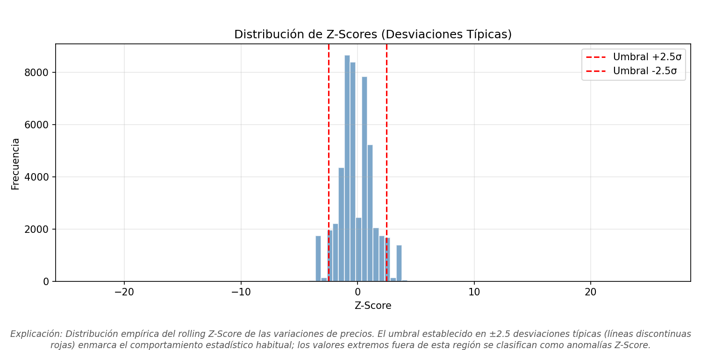

Las líneas rojas en ±2.5σ delimitan el umbral: todo valor fuera de esta región es una anomalía temporal.

</td>
<td width="50%">

**Isolation Forest — Distribución de scores**

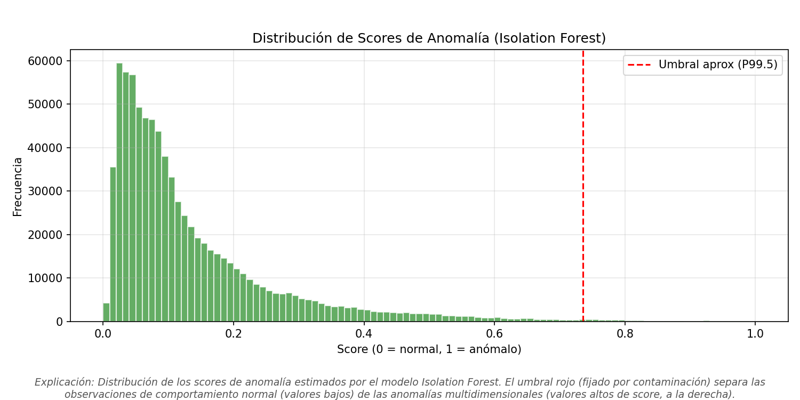

El umbral (línea roja, P99.5) separa las observaciones normales (scores bajos) de las anomalías multidimensionales (scores altos).

</td>
</tr>
<tr>
<td>

**Isolation Forest — Comparativa de features: Normal vs Anomalía**

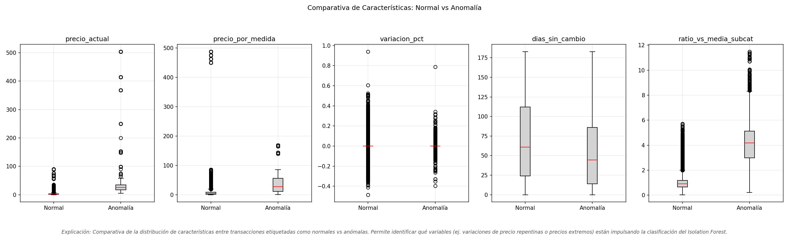

Las anomalías IF presentan un `ratio_vs_media_subcat` extremo (2x-11x), confirmando que son productos estructuralmente premium en subcategorías baratas.

</td>
<td>

**Autoencoder LSTM — Distribución del error de reconstrucción**

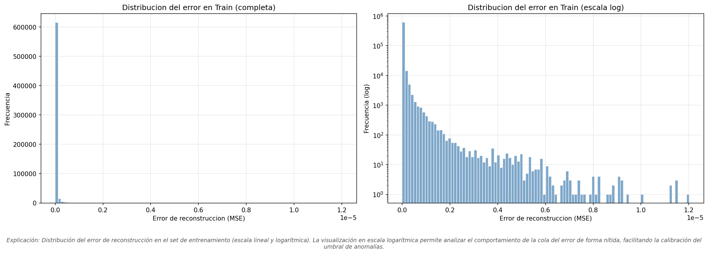

La distribución bimodal (escala log, derecha) confirma que el Autoencoder separa eficazmente secuencias estables (error ≈ 0) de secuencias con cambios de precio (cola derecha).

</td>
</tr>
<tr>
<td colspan="2">

**Autoencoder LSTM — Curvas de entrenamiento (Google Colab)**

<p align="center">
  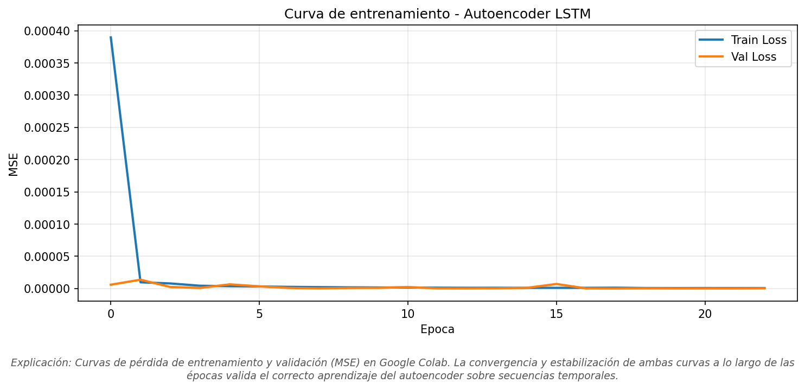
</p>

Convergencia rápida del MSE en entrenamiento y validación (GPU T4 en Colab). La estabilización tras la época 5 confirma que el modelo no sobreajusta a los patrones normales.

</td>
</tr>
</table>

### LSTM Clasificador — Optimización del umbral

<table>
<tr>
<td width="50%">

**Curvas Precision-Recall vs Threshold**

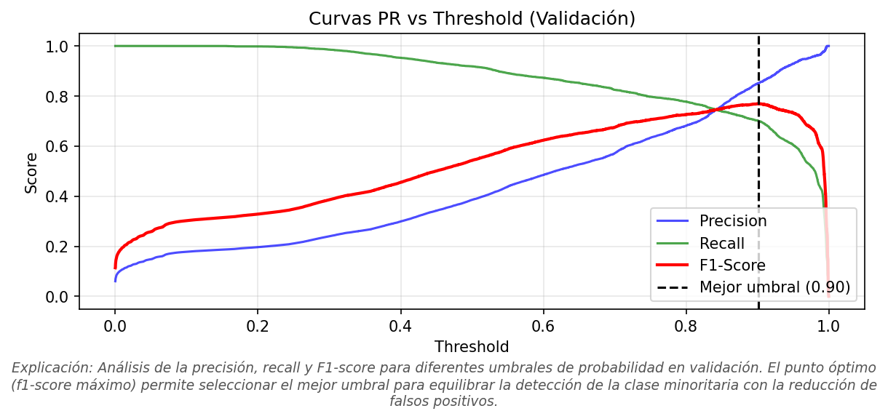

El umbral óptimo (0.90, línea negra) maximiza el F1-Score en validación, equilibrando la detección de cambios reales con la minimización de falsas alarmas.

</td>
<td width="50%">

**Baseline (Regresión Logística) — Matriz de confusión**

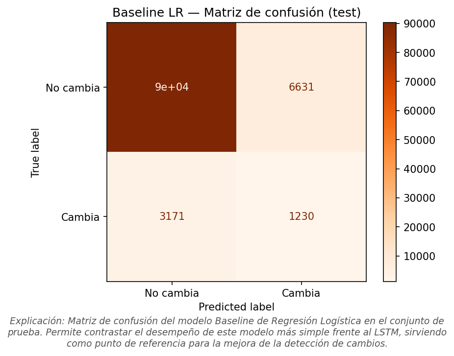

La Regresión Logística detecta solo 1,230 de 4,401 cambios (Recall 27.9%), confirmando que el aplanamiento de los datos destruye las interacciones temporales captadas por el LSTM.

</td>
</tr>
</table>

### XGBoost — Explicabilidad SHAP

<p align="center">
  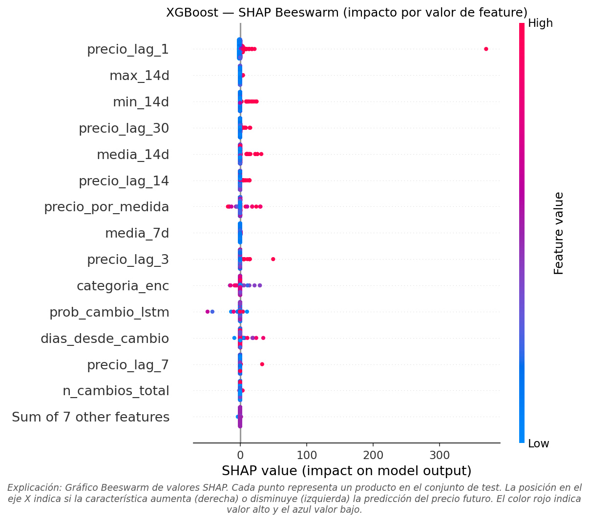
</p>
<p align="center"><em>Beeswarm Plot SHAP: cada punto es una predicción del conjunto de test. El color indica el valor de la feature (rojo = alto, azul = bajo). Se observa que valores altos de <code>precio_lag_1</code> empujan la predicción al alza (puntos rojos a la derecha), mientras que <code>prob_cambio_lstm</code> actúa como modulador de incertidumbre.</em></p>

### Clustering — Selección de K y validación

<table>
<tr>
<td width="50%">

**Método del Codo + Silhouette Score por K**

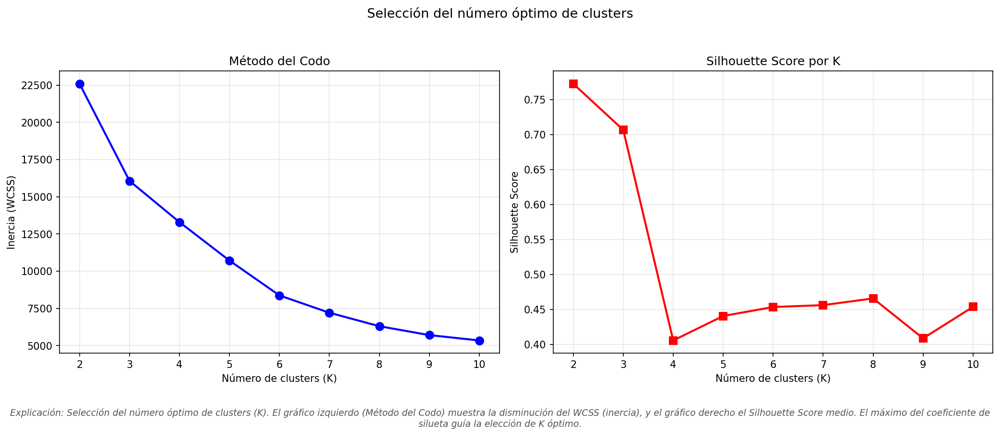

K=5 se selecciona en el punto de inflexión de inercia (izq.) y se valida con un Silhouette Score competitivo de 0.441 (dcha.).

</td>
<td width="50%">

**Silhouette Plot — Análisis de cohesión por cluster**

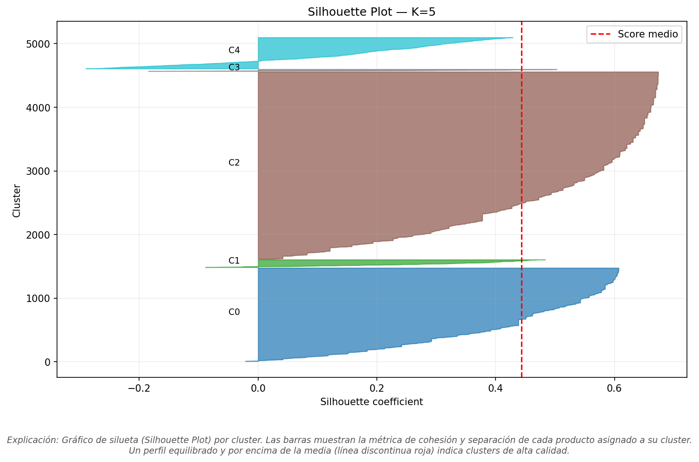

Los Clusters 0 y 2 muestran perfiles gruesos y simétricos (buena cohesión). El Cluster 1 (Marcas Nacionales en Promoción) tiene un perfil más delgado y valores negativos, reflejando la heterogeneidad inherente a los productos de marca comercial.

</td>
</tr>
</table>

### NLP — Distribución de similitud

<p align="center">
  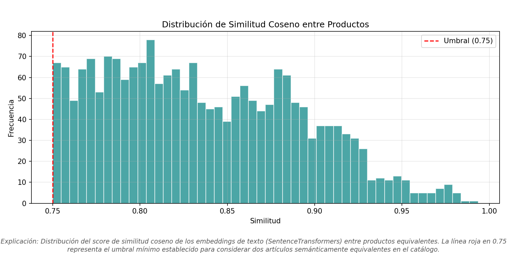
</p>
<p align="center"><em>Distribución del score de similitud coseno entre los 924 pares equivalentes. La densidad principal entre 0.78-0.90 indica matches de alta calidad, con una cola hasta 1.0 correspondiente a equivalencias casi exactas (ej. tomate frito Hacendado ↔ Hida, sim=0.96).</em></p>

---

## 👤 Autor

**Daniel Porras Morales**  
Trabajo Fin de Estudios — Curso de Especialización en Inteligencia Artificial y Big Data  
2025-2026

---

## 📄 Licencia

MIT License — Daniel Porras Morales — 2026
