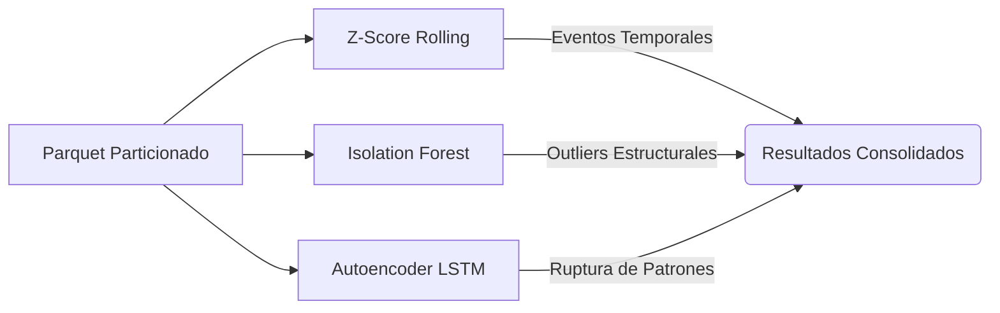

# Análisis del Módulo de Detección de Anomalías

> Documento de análisis integrado de los módulos de aprendizaje automático para la detección de anomalías (`src/ml/anomalias_*.py`).
> Recoge el diseño, validación y comparativa de tres enfoques complementarios (Estadístico, Machine Learning Clásico y Deep Learning) aplicados al histórico de precios.

---

## 1. Arquitectura del Pipeline de Anomalías

El sistema implementa tres modelos que atacan el problema de la anomalía desde diferentes dimensiones matemáticas y conceptuales:

### Decisiones de diseño clave por modelo

| Modelo | Dimensión Analizada | Parámetros Clave | Justificación |
|--------|---------------------|------------------|---------------|
| **Z-Score** | Temporal (Univariante) | `ventana=14d`, `umbral=2.5σ` | Actúa como *baseline*. Detecta cambios bruscos de precio locales. 2.5σ reduce falsos positivos en series estables. |
| **Isolation Forest** | Espacial (Multivariante) | `n_estimators=200`, `contam=0.5%` | Evalúa todas las features a la vez (precio, ratios, variaciones). La tasa del 0.5% se alinea con el baseline del Z-Score para ser comparables. |
| **Autoencoder LSTM** | Secuencial (Deep Learning)| `ventana=14d`, `Umbral=P99` | Aprende de secuencias sin variación ("normalidad") y falla al reconstruir secuencias anómalas. El umbral P99 (1%) equipara la rigurosidad con los otros métodos. |

---

## 2. Resultados Globales y Comparativa

Los modelos se ejecutaron sobre el histórico completo (763,435 filas). La métrica clave de la comparativa es el solapamiento (Jaccard), que revela si los modelos detectan las mismas anomalías o son ortogonales.

| Método                                      | Evaluadas | Anomalías | Tasa  | Productos afectados | Jaccard vs ZS | Jaccard vs IF |
| ------------------------------------------- | --------- | --------- | ----- | ------------------- | ------------- | ------------- |
| Z-Score rolling (14d, 2.5σ)                 | 763,435   | 3,813     | 0.50% | 1,683               | —             | —             |
| Isolation Forest (200 árboles, contam=0.5%) | 763,435   | 3,818     | 0.50% | 59                  | 0.006         | —             |
| Autoencoder LSTM (ventana=14d, P99)         | 692,816*  | 6,929     | 1.00% | 1,300               | 0.000         | 0.005         |

> *El Autoencoder evalúa secuencias temporales completas (ventanas de 14 días) en lugar de observaciones individuales, por lo que el número total es ligeramente menor.*

> [!IMPORTANT]
> **Complementariedad extrema:** El índice Jaccard cercano a cero (0.006, 0.005 y 0.000) demuestra que los tres métodos no son redundantes. Cada uno captura una dimensión de anomalía completamente distinta.

---

## 3. Análisis Detallado por Modelo

### 3.1 Z-Score: El Baseline Temporal

El Z-Score Rolling funciona como un detector de **eventos temporales**. Al usar una ventana deslizante de 14 días, se adapta a la inflación o deflación progresiva, marcando únicamente subidas o bajadas drásticas.

- **Comportamiento:** Afecta a **1,683 productos** de forma muy distribuida (~2.3 anomalías/producto).
- **Categorías destacadas:** Fruta y verdura (705), agua y refrescos (441), bodega (389), cuidado facial y corporal (247) y marisco y pescado (190).
- **Marcas más afectadas:** Comercial (2,789), Hacendado (757) y Deliplus (187).

### 3.2 Isolation Forest: Anomalías Estructurales

IF detecta rarezas en el espacio multidimensional usando features como `precio_actual`, `precio_por_medida`, `variacion_pct`, `dias_sin_cambio` y `ratio_vs_media_subcat`. 

- **El Hallazgo Clave:** IF marcó **3,818 anomalías** pero hiper-concentradas en solo **59 productos** (~64.7 anomalías/producto).
- **Categorías destacadas:** Charcutería y quesos (1,442), limpieza y hogar (406), congelados (341), marisco y pescado (295) y cuidado facial y corporal (286).
- **Marcas más afectadas:** Comercial (2,889), Hacendado (607) y Compy (280).
- **Interpretación y Validación:** IF no detecta un "cambio" puntual de precio, sino que flaggea productos que son **estructuralmente raros** consistentemente. De los 59 productos afectados, la gran mayoría representan productos muy caros dentro de subcategorías baratas (ej. Jamón Ibérico de Bellota o quesos gourmet de importación en charcutería, o alimentos especializados de mascotas de marca Compy en perfumería/hogar). El modelo segmenta con total éxito el catálogo premium y detecta anomalías estructurales multivariantes.

### 3.3 Autoencoder LSTM: Ruptura de Patrones y Entrenamiento en Colab

El Autoencoder LSTM se entrena exclusivamente con secuencias "sanas" (donde el precio permaneció completamente plano) para que aprenda a reconstruir la estabilidad temporal y falle ante cualquier variación de precio.

- **Entrenamiento Offline (Google Colab GPU):** 
  - Entrenado con **642,396 secuencias normales** de una ventana de 14 días y 3 features principales (`precio_actual_norm`, `variacion_pct` y `dias_sin_cambio_norm`).
  - Arquitectura profunda con dos capas LSTM en el Encoder (64 y 32 unidades), un cuello de botella (`RepeatVector`), y dos capas LSTM en el Decoder (32 y 64 unidades). Total: 63,171 parámetros.
  - La convergencia fue excelente: el entrenamiento con parada temprana (*early stopping*) finalizó en la época 23, restaurando los mejores pesos de la **época 18** con un error MSE de entrenamiento de `1.2790e-06` y de validación de apenas `2.7779e-08`.
  - El error de reconstrucción sobre el set de entrenamiento validó un ajuste óptimo, con una media de `3.43e-08` y un máximo de `1.20e-05`.

- **Distribución de Error en Inferencia:** Al evaluar el conjunto total de secuencias (692,816), la distribución del error de reconstrucción es bimodal: el modelo reconstruye a la perfección las secuencias sin cambios, pero acumula un error elevado en aquellas con variaciones de precio.
  - **Media:** 0.00516968 | **Desviación Estándar:** 0.02351886
  - **Mínimo:** 0.00000000 | **Máximo:** 0.19838797

- **Calibración de Umbral:** Se seleccionó el **Percentil 99 (P99)** de la distribución de inferencia como umbral de anomalía, estableciéndolo en `0.1410443187`. Esto genera una tasa de anomalía exacta del **1.00%** (6,929 secuencias marcadas).
- **Categorías destacadas:** Cuidado facial y corporal (768), bodega (611), agua y refrescos (566), cuidado del cabello (462) y charcutería y quesos (425).
- **Distribución por marca:** Comercial (3,518), Hacendado (2,323), Deliplus (777), Bosque Verde (268) y Compy (43).

---

## 4. Decisiones Técnicas y de Infraestructura

Durante el desarrollo del Autoencoder LSTM se plantearon retos importantes a nivel de hardware y configuración del entorno local.

### 4.1 El problema del "Soporte Nativo" en Windows

> [!WARNING]  
> A partir de TensorFlow 2.11, Google dejó de dar soporte directo a GPUs en entornos Windows "puro" (instalado vía pip). 

¿La solución teórica? Si se quiere usar la GPU local en Windows, es necesario instalar y configurar **WSL2** (Windows Subsystem for Linux). Dentro de ese entorno Linux virtual, TensorFlow sí es capaz de reconocer y utilizar la GPU. Sin WSL2, por mucha potencia gráfica que tenga el equipo, la ejecución local de TensorFlow se limitará forzosamente a la CPU.

### 4.2 ¿Valía la pena configurar WSL2 para mi GTX 960?

La máquina de desarrollo local cuenta con una GPU NVIDIA GTX 960. Si bien configurar WSL2, CUDA y cuDNN era técnicamente posible, **no resultaba viable ni eficiente para Deep Learning** por las siguientes razones:

- **Limitación crítica de Memoria (VRAM):** Mi GTX 960 dispone de apenas **2 GB de VRAM**, lo que se considera el mínimo absoluto (e insuficiente en la práctica). La mayoría de modelos de arquitecturas modernas lanzarían un error de *"Out of Memory" (OOM)* antes incluso de procesar el primer batch.
- **Dolores de cabeza vs Beneficios:** El tiempo invertido en configurar el entorno WSL2/CUDA para una tarjeta de 2 GB acabaría generando más frustraciones por falta de memoria que beneficios reales de velocidad. Se queda corta de recursos para el Deep Learning actual.

### 4.3 La Solución: Offline Training + Online Inference

Ante esta limitación de hardware local, se optó por un flujo de trabajo asíncrono y en la nube:

1. **Entrenamiento (Offline en la Nube):** El modelo se entrena en Google Colab (`anomalias_autoencoder_colab.ipynb`), un entorno que provee de forma transparente **GPUs NVIDIA T4 con 16 GB de VRAM**. Estas tarjetas son idóneas y significativamente más rápidas y capaces que la GTX 960 local.
2. **Exportación:** Tras el entrenamiento, se guardan los pesos del modelo (`.keras`) y el umbral de anomalía calibrado (`.pkl`) al directorio `models/` sincronizado mediante Google Drive.
3. **Inferencia (Online en Local):** El script local del pipeline (`anomalias_autoencoder.py`) detecta los artefactos pre-entrenados y realiza únicamente la pasada *forward* (inferencia). Esta operación es lo suficientemente ligera para ejecutarse eficientemente en la **CPU** del entorno Windows durante la carga incremental diaria.

---

## 5. Conclusión

La implementación multimodelo para la detección de anomalías ha sido validada con éxito.

El pipeline multimodelo funciona de forma correcta y complementaria. Lejos de competir entre sí o generar duplicidades, **cada modelo detecta una tipología de anomalía distinta**:
- **Z-Score** captura fluctuaciones y ofertas temporales rápidas.
- **Isolation Forest** detecta productos premium estables y posibles errores de catalogación en el espacio multivariante.
- **Autoencoder LSTM** modela la estabilidad del comportamiento secuencial a lo largo del tiempo.

Esta combinación garantiza una cobertura robusta que alimenta de forma integral los dashboards de Kibana para el seguimiento de la estrategia de precios.
