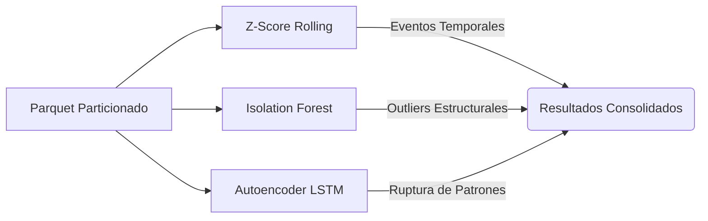

# Análisis del Módulo de Detección de Anomalías

> Documento de análisis integrado de los módulos de aprendizaje automático para la detección de anomalías (`src/ml/anomalias_*.py`).
> Recoge el diseño, validación y comparativa de tres enfoques complementarios (Estadístico, Machine Learning Clásico y Deep Learning) aplicados al histórico de precios.

---

## 1. Arquitectura del Pipeline de Anomalías

El sistema implementa tres modelos que atacan el problema de la anomalía desde diferentes dimensiones matemáticas y conceptuales:

### Decisiones de diseño clave por modelo

| Modelo | Dimensión Analizada | Parámetros Clave | Justificación |
|--------|---------------------|------------------|---------------|
| **Z-Score** | Temporal (Univariante) | `ventana=14d`, `umbral=2.5σ` | Actúa como *baseline*. Detecta cambios bruscos de precio locales. 2.5σ reduce falsos positivos en series estables. |
| **Isolation Forest** | Espacial (Multivariante) | `n_estimators=200`, `contam=0.5%` | Evalúa todas las features a la vez (precio, ratios, variaciones). La tasa del 0.5% se alinea con el baseline del Z-Score para ser comparables. |
| **Autoencoder LSTM** | Secuencial (Deep Learning)| `ventana=14d`, `Umbral=P99` | Aprende de secuencias sin variación ("normalidad") y falla al reconstruir secuencias anómalas. El umbral P99 (1%) equipara la rigurosidad con los otros métodos. |

---

## 2. Resultados Globales y Comparativa

Los modelos se ejecutaron sobre el histórico completo (668,625 filas). La métrica clave de la comparativa es el solapamiento (Jaccard), que revela si los modelos detectan las mismas anomalías o son ortogonales.

| Método                                      | Evaluadas | Anomalías | Tasa  | Productos afectados | Jaccard vs ZS | Jaccard vs IF |
| ------------------------------------------- | --------- | --------- | ----- | ------------------- | ------------- | ------------- |
| Z-Score rolling (14d, 2.5σ)                 | 668,625   | 3,293     | 0.49% | 1,545               | —             | —             |
| Isolation Forest (200 árboles, contam=0.5%) | 668,625   | 3,343     | 0.50% | 59                  | 0.005         | —             |
| Autoencoder LSTM (ventana=14d, P99)         | 599,161*  | 5,992     | 1.00% | 1,031               | 0.000         | 0.004         |

> *El Autoencoder evalúa secuencias temporales completas (ventanas de 14 días) en lugar de observaciones individuales, por lo que el número total es ligeramente menor.*

> [!IMPORTANT]
> **Complementariedad extrema:** El índice Jaccard cercano a cero (0.005 y 0.000) demuestra que los tres métodos no son redundantes. Cada uno captura una dimensión de anomalía completamente distinta.

---

## 3. Análisis Detallado por Modelo

### 3.1 Z-Score: El Baseline Temporal

El Z-Score Rolling funciona como un detector de **eventos temporales**. Al usar una ventana deslizante de 14 días, se adapta a la inflación o deflación progresiva, marcando únicamente subidas o bajadas drásticas.

- **Comportamiento:** Afecta a 1,545 productos de forma muy distribuida (~2.1 anomalías/producto).
- **Categorías destacadas:** Fruta y verdura (626), agua y refrescos (398), marisco y pescado (156). Estas son categorías naturalmente volátiles donde los precios cambian bruscamente.

### 3.2 Isolation Forest: Anomalías Estructurales

IF detecta rarezas en el espacio multidimensional usando features derivadas como `ratio_vs_media_subcat`. 

- **El Hallazgo Clave:** IF marcó 3,343 anomalías pero concentradas en solo **59 productos** (~56.7 anomalías/producto).
- **Interpretación:** IF no detecta un "cambio" de precio, sino que flaggea productos que son **estructuralmente raros** todos los días. 
- **Validación:** De los 59 productos afectados, el 87.5% son productos muy caros dentro de subcategorías baratas (ej. Jamón Ibérico de Bellota a 504€ en Charcutería, o cochinillo asado a 50€ en Carne). El modelo está segmentando exitosamente el catálogo premium.

### 3.3 Autoencoder LSTM: Ruptura de Patrones

El Autoencoder LSTM fue entrenado exclusivamente con secuencias "sanas" (sin cambios de precio).

- **Distribución Bimodal:** El análisis de errores de reconstrucción reveló una distribución fuertemente bimodal. La mayoría de secuencias tienen error cercano a 0 (precio plano, fácil de reconstruir), con una cola pronunciada de errores altos cuando ocurre una variación.
- **Calibración de Umbral:** Debido a la bimodalidad, el P90 tenía un valor muy bajo que generaba un 10% de anomalías (excesivo). Se seleccionó el **Percentil 99 (P99)**, dejando una tasa del 1.00%, comparable operativamente con el 0.5% del Z-Score e IF, manteniendo alta precisión.

---

## 4. Decisiones Técnicas y de Infraestructura

Durante el desarrollo del Autoencoder LSTM se plantearon retos importantes a nivel de hardware y configuración del entorno local.

### 4.1 El problema del "Soporte Nativo" en Windows

> [!WARNING]  
> A partir de TensorFlow 2.11, Google dejó de dar soporte directo a GPUs en entornos Windows "puro" (instalado vía pip). 

¿La solución teórica? Si se quiere usar la GPU local en Windows, es necesario instalar y configurar **WSL2** (Windows Subsystem for Linux). Dentro de ese entorno Linux virtual, TensorFlow sí es capaz de reconocer y utilizar la GPU. Sin WSL2, por mucha potencia gráfica que tenga el equipo, la ejecución local de TensorFlow se limitará forzosamente a la CPU.

### 4.2 ¿Valía la pena configurar WSL2 para mi GTX 960?

La máquina de desarrollo local cuenta con una GPU NVIDIA GTX 960. Si bien configurar WSL2, CUDA y cuDNN era técnicamente posible, **no resultaba viable ni eficiente para Deep Learning** por las siguientes razones:

- **Limitación crítica de Memoria (VRAM):** Mi GTX 960 dispone de apenas **2 GB de VRAM**, lo que se considera el mínimo absoluto (e insuficiente en la práctica). La mayoría de modelos de arquitecturas modernas lanzarían un error de *"Out of Memory" (OOM)* antes incluso de procesar el primer batch.
- **Dolores de cabeza vs Beneficios:** El tiempo invertido en configurar el entorno WSL2/CUDA para una tarjeta de 2 GB acabaría generando más frustraciones por falta de memoria que beneficios reales de velocidad. Se queda corta de recursos para el Deep Learning actual.

### 4.3 La Solución: Offline Training + Online Inference

Ante esta limitación de hardware local, se optó por un flujo de trabajo asíncrono y en la nube:

1. **Entrenamiento (Offline en la Nube):** El modelo se entrena en Google Colab (`anomalias_autoencoder_colab.ipynb`), un entorno que provee de forma transparente **GPUs NVIDIA T4 con 16 GB de VRAM**. Estas tarjetas son idóneas y significativamente más rápidas y capaces que la GTX 960 local.
2. **Exportación:** Tras el entrenamiento, se guardan los pesos del modelo (`.keras`) y el umbral de anomalía calibrado (`.pkl`) al directorio `models/` sincronizado mediante Google Drive.
3. **Inferencia (Online en Local):** El script local del pipeline (`anomalias_autoencoder.py`) detecta los artefactos pre-entrenados y realiza únicamente la pasada *forward* (inferencia). Esta operación es lo suficientemente ligera para ejecutarse eficientemente en la **CPU** del entorno Windows durante la carga incremental diaria.

---

## 5. Conclusión

La implementación multimodelo para la detección de anomalías ha sido validada con éxito. En lugar de competir por encontrar los mismos *outliers*, los modelos segmentan de forma ortogonal:

- Si se busca alertar sobre **fluctuaciones y promociones**, el `Z-Score` es la herramienta adecuada.
- Si el negocio busca entender su **segmento ultra-premium o detectar errores de catalogación**, el `Isolation Forest` proporciona los insights.
- Si se necesita modelar la **estabilidad a largo plazo** y capturar disrupciones sutiles del mercado, el `Autoencoder LSTM` es superior.

Esta combinación garantiza una cobertura robusta que alimenta de forma integral los dashboards de Kibana para el seguimiento de la estrategia de precios.
