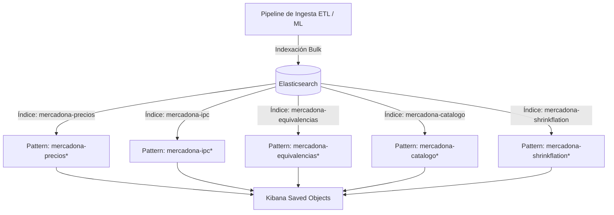
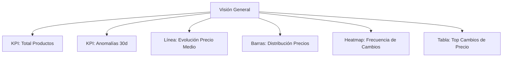

# Análisis de los Dashboards de Kibana

> Documento de análisis técnico integrado de la capa de visualización e Inteligencia de Negocio en Kibana (`dashboards/export.ndjson`).
> Detalla el diseño, la estructura de mappings de Elasticsearch y la configuración analítica de los cinco dashboards interactivos utilizados para monitorizar precios, catalogación, equivalencias NLP y detección de anomalías de mercado.

---

## 1. Arquitectura de Datos y Patrones de Índices

El sistema utiliza **Elasticsearch** como motor de búsqueda y agregación en tiempo real. La ingesta diaria automatizada puebla cinco índices específicos, los cuales están expuestos en Kibana mediante patrones de índices (Index Patterns) con optimizaciones y campos calculados sobre la marcha (*runtime fields*).



### Detalle de Patrones de Índices (Index Patterns)

| Patrón de Índice | Origen (Índice ES) | Propósito Analítico | Campos Clave | Optimización Especial |
| :--- | :--- | :--- | :--- | :--- |
| **`mercadona-precios*`** | `mercadona-precios` | Registro histórico diario de precios del catálogo y banderas de anomalías. | `referencia` (long), `precio_actual` (float), `anomalia_zscore` (bool), `anomalia_if` (bool), `anomalia_ae` (bool). | Formateo numérico a moneda (`$0,0.00`) para precios y uso de IDs determinísticos (`{ref}_{fecha}`) para evitar duplicación. |
| **`mercadona-ipc*`** | `mercadona-ipc` | Seguimiento del coste y variación acumulada de cestas de compra tipo. | `ipc` (float), `gasto_estimado` (float), `nombre_cesta` (keyword), `perfil` (keyword), `fecha` (date). | **Script Painless Runtime:** Genera `variacion_pct_real` dividiendo `variacion_pct` entre 100 para formatearse como porcentaje nativo. |
| **`mercadona-equivalencias*`** | `mercadona-equivalencias` | Relaciones de sustitución entre marcas comerciales y marca propia detectadas por NLP. | `titulo_com` (text), `titulo_mp` (text), `similitud` (float), `diferencia_por_medida_pct` (float). | Formateo dinámico de similitud y ahorro a formato porcentual nativo en Kibana. |
| **`mercadona-catalogo*`** | `mercadona-catalogo` | Métricas de tamaño del catálogo activo, altas y bajas diarias. | `tamaño_catalogo` (integer), `nuevos` (integer), `descatalogados` (integer), `fecha` (date). | Mappings optimizados para agregaciones temporales veloces sobre históricos masivos. |
| **`mercadona-shrinkflation*`** | `mercadona-shrinkflation` | Alertas consolidadas de reduflación identificadas en el pipeline ETL. | `var_precio_pct` (float), `var_medida_pct` (float), `severidad` (float), `fecha_actual` (date). | Formateo de porcentajes y decimales de severidad calibrados. |

---

## 2. Optimización mediante Scripts Painless (Runtime Fields)

Para evitar la re-indexación masiva de datos históricos cuando se modifican los formatos de presentación, se han implementado campos calculados en tiempo de ejecución utilizando el motor de scripting **Painless** de Elasticsearch.

Un ejemplo crítico es la normalización de la variación porcentual en el índice de IPC:

> [!NOTE]
> **Script Painless para `variacion_pct_real`:**
> ```painless
> if (doc['variacion_pct'].size() != 0) {
>     emit(doc['variacion_pct'].value / 100.0);
> }
> ```
> *Justificación:* El pipeline de Python guarda las variaciones acumuladas como números reales (ej. `5.3` para un `5.3%`). Sin embargo, Kibana requiere fracciones de base decimal (ej. `0.053`) para aplicar el formateador nativo de tipo `percent` (`0,0.00%`). Este script en tiempo de ejecución realiza la conversión al vuelo sin costo apreciable de CPU.

---

## 3. Catálogo de Dashboards e Inteligencia de Negocio

El archivo `export.ndjson` empaqueta **cinco dashboards empresariales** que cubren las áreas estratégicas de la investigación del TFE.

### 3.1 MercaIntelligence — Visión General

Está diseñado para ofrecer un control de mando macroscópico del estado del catálogo de Mercadona y la volatilidad del mercado.



*   **KPIs Estratégicos:**
    *   `[V1] Total productos`: Cuenta la cardinalidad única de `referencia` para dimensionar el catálogo total bajo estudio (~4,340 productos diarios activos).
    *   `[V2] Anomalías Detectadas (Últimos 30 días)`: Mide la cantidad de observaciones catalogadas como anómalas por cualquiera de los tres modelos de ML en el último mes.
*   **Paneles de Distribución y Serie Temporal:**
    *   `[V3] Evolución Precio Medio por Categoría`: Gráfico de líneas que ilustra la tendencia inflacionaria agrupada por las principales categorías de productos, permitiendo identificar qué secciones (ej. Bebés, Pescadería) lideran las alzas.
    *   `[V4] Distribución Precios por Categoría`: Diagrama de barras horizontales que desglosa los percentiles 25, 50 y 75 del precio. Muestra visualmente la dispersión de precios, revelando qué categorías tienen mayor amplitud de gama.
*   **Análisis de Volatilidad:**
    *   `[V5] Mapa de Calor Cambios por Semana`: Un *Heatmap* bidimensional (Semana x Categoría) que pinta con gradientes de verde la frecuencia de modificaciones en los precios. Permite descubrir patrones estacionales de volatilidad o campañas de cambios masivos.
    *   `[V6] Top Productos con Cambio de Precio`: Tabla de auditoría directa que lista los productos más inestables con sus precios previos y actuales.

---

### 3.2 MercaIntelligence — Alertas de Anomalías

Este dashboard centraliza el control de calidad y detección de eventos inusuales en los precios diarios mediante el pipeline de Machine Learning multimodelo.

*   **KPIs de Rendimiento Multimodelo:**
    *   `[A1] KPI Anomalías Z-Score` (Detección estadística local).
    *   `[A2] KPI Anomalías IF` (Detección espacial multivariante).
    *   `[A3] KPI Anomalías AE` (Detección secuencial por Deep Learning).
*   **Paneles Avanzados:**
    *   `[A4] Evolución temporal anomalías por método`: Gráfico de líneas que cruza la cantidad de alertas generadas semanalmente por cada modelo. Sirve para evaluar si las detecciones ocurren al unísono (eventos sistémicos) o de manera asíncrona.
    *   `[A5] Anomalías por Categoría y Método`: Gráfico de barras apiladas que expone qué departamentos acumulan más alertas y qué algoritmo las detecta, aportando transparencia operativa.
    *   `[A6] Distribución score Isolation Forest`: Histograma que muestra la distribución de severidad de los outliers espaciales, separando las rarezas extremas de las moderadas.
    *   `[A7] Productos Detectados por Múltiples Métodos`:
        > [!IMPORTANT]
        > **Consolidación de Alertas:** Esta tabla identifica aquellos productos que han hecho saltar las alarmas de más de un modelo simultáneamente (intersección Z-Score e Isolation Forest). Estas coincidencias representan **alertas de máxima prioridad** para el equipo de analistas de negocio, reduciendo drásticamente la tasa de falsos positivos.

---

### 3.3 MercaIntelligence — Análisis de Marcas

Enfocado en la comparativa de precios y el posicionamiento de la Marca Propia (Hacendado, Deliplus, Bosque Verde) frente a las Marcas Comerciales de fabricantes líderes del sector.

*   **KPIs de Posicionamiento:**
    *   `[M1] Precio Medio Marca Propia` vs `[M2] Precio Medio Marca Comercial`: Evidencia la brecha de precios base entre ambos segmentos de catálogo.
*   **Visualizaciones Comparativas:**
    *   `[M4] Evolución Precio MP vs Comercial`: Gráfico temporal lineal que rastrea la evolución del precio medio diario de ambos grupos. Permite auditar si la marca propia imita las subidas de la marca comercial de forma inmediata o mantiene la distancia de protección competitiva.
    *   `[M3] Precio Mediano por Marca Propia`: Barra comparativa de medianas para mitigar el sesgo de productos ultra-premium en marcas de fabricante.
*   **Módulo NLP Marca Blanca (Brand-Switching):**
    *   `[M6] Equivalencias NLP y Margen de Ahorro`: Tabla de datos enriquecida que presenta las sugerencias calculadas con similitud semántica de embeddings vectoriales. Cruza productos comerciales directos con su homólogo de Hacendado, reportando la similitud semántica y el porcentaje de ahorro real por medida métrica.

---

### 3.4 MercaIntelligence — Catálogo & Shrinkflation

Supervisa la salud logística del surtido (lanzamientos y descatalogaciones) y centraliza las alertas del algoritmo de detección de reduflación.

*   **Métricas de Ciclo de Vida del Catálogo:**
    *   `[C1] KPI Nuevos Productos` y `[C2] KPI Descatalogados`.
    *   `[C3] Evolución de Altas y Bajas`: Histograma temporal que muestra la tasa de renovación del catálogo por semanas, ilustrando picos de rotación estacionales.
    *   `[C4] Evolución del Tamaño del Catálogo`: Monitoriza la estabilidad de la cobertura del scraper y la expansión de referencias del supermercado.
*   **Detección Operativa de Reduflación:**
    *   `[S1] Alertas de Shrinkflation Activas`: Tabla crítica que extrae los datos de `mercadona-shrinkflation*` y reporta los productos sospechosos. Presenta las columnas clave de auditoría:
        $$\text{Severidad} = \frac{\Delta\% \text{ Precio por Medida} - \Delta\% \text{ Precio Actual}}{100}$$
        Facilita la inspección de casos donde el gramaje se reduce discretamente pero la tarifa final al consumidor permanece inalterada.
    *   `[S2] Distribución de Reduflación por Categoría`: Identifica qué secciones de alimentación o droguería están aplicando esta práctica con mayor concentración en el mercado actual.

---

### 3.5 MercaIntelligence — IPC Personalizado

Soporte analítico del motor de cálculo de inflación personalizada basada en perfiles socioeconómicos de consumo del mundo real.

*   **Métricas Resumen:**
    *   `[IPC1] Resumen IPC por Perfil`: Cuadro integral que compara el índice actual (Base 100 = Noviembre 2025), la variación acumulada global y el coste total mensual de la cesta según el perfil seleccionado (Dani, Estudiante, Cesta Familiar, etc.).
*   **Análisis Histórico de Inflación:**
    *   `[IPC2] Evolución IPC por Perfil`: Gráfico de líneas temporales múltiples que compara el ritmo inflacionario de los distintos perfiles de consumidor.
    *   `[IPC3] Variación Acumulada por Perfil`: Gráfico de barras que clasifica de mayor a menor a los perfiles más golpeados por la evolución de precios.
*   **Visualización de umbral Base 100:**
    *   > [!TIP]
        > **Línea de Referencia:** Los gráficos de evolución de IPC incluyen una línea de umbral horizontal estática (`thresholdLine`) fijada en el valor **100** y pintada en color rojo discontinuo. Esto permite distinguir de forma inmediata e intuitiva si una cesta se encuentra en terreno inflacionario (por encima de 100) o deflacionario/ahorro (por debajo de 100).

---

## 4. Decisiones de Ingeniería y Conclusión

La configuración y exportación estructurada de este entorno Kibana aporta sólidos cimientos técnicos al TFE:

1.  **Indexación Segura y Escalable:** Al definir tipos estrictos como `keyword` para dimensiones categóricas y `keyword` de alta precisión mediante `raw` para búsquedas exactas sobre campos de texto, las búsquedas y agregaciones en Kibana se ejecutan en milisegundos, incluso sobre millones de filas.
2.  **Optimización de Almacenamiento:** El uso inteligente de *wildcards* e índices mensuales en Elasticsearch garantiza que los logs del scraper diario puedan archivarse o depurarse de forma automatizada sin romper las visualizaciones históricas de los dashboards.
3.  **Monitoreo Holístico:** Estos cinco dashboards integran en un único punto visual el trabajo de los scripts de ingesta (ETL), los algoritmos de detección estadística (Z-Score), los modelos de aprendizaje clásico (Isolation Forest), las redes neuronales de secuencias (LSTM), el procesamiento del lenguaje natural (NLP) y los cálculos de economía doméstica (IPC), cerrando con éxito el ciclo de vida del dato del proyecto.
