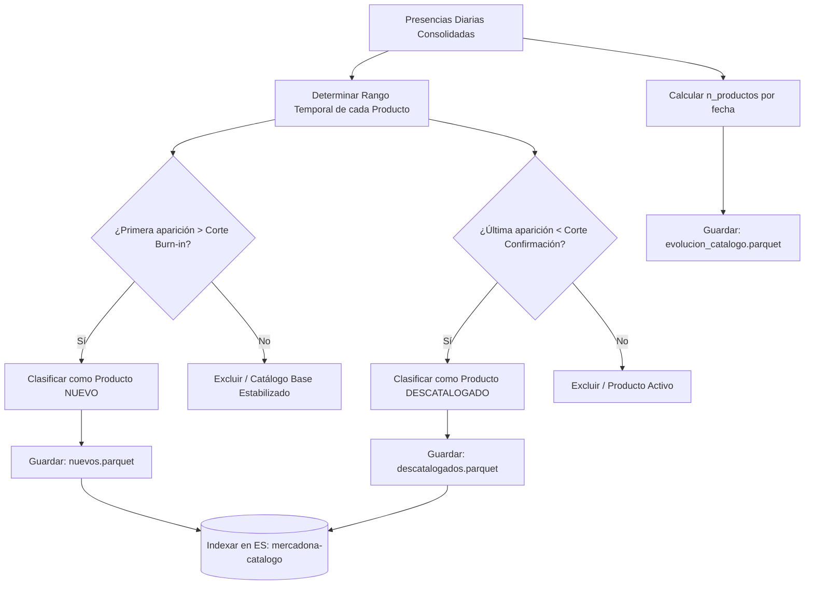

# Análisis del Módulo de Rotación y Cambios en el Catálogo

> Documento de análisis integrado del módulo de detección de novedades y descatalogaciones (`src/etl/detector_catalogo.py`).
> Recoge el diseño técnico, el modelado del volumen diario del catálogo, las justificaciones metodológicas del periodo de quemado (*burn-in*) y confirmación de baja, así como los insights comerciales de estacionalidad y penetración de marcas en Mercadona.

---

## 1. Contexto e Importancia de la Rotación del Catálogo

En la gestión moderna del *retail* de alimentación, el catálogo de productos es una estructura viva y dinámica. Los supermercados ajustan constantemente su surtido introduciendo **novedades (altas)** para capturar tendencias de consumo y retirando productos **descatalogados (bajas)** que no cumplen los márgenes de rotación, rentabilidad, o debido a cambios de proveedor.

Para el proyecto MercaIntelligence, monitorizar esta rotación no solo proporciona una métrica descriptiva del catálogo, sino que constituye una **fuente de contexto esencial** para los módulos predictivos y analíticos:
- Un producto recién lanzado no tiene historial y puede distorsionar los agregados del IPC.
- Un producto descatalogado deja de recibir precios y congelaría el estado transaccional en `ultimo_precio.parquet` si no se detecta su baja.
- El análisis de la naturaleza (marca propia vs. comercial) y categoría de las altas revela las apuestas estratégicas del distribuidor en el mercado.

---

## 2. Arquitectura de Detección de Altas y Bajas

El script procesa la totalidad del histórico consolidado de "presencias" diarias de productos (763,435 registros de presencia, que cubren 176 extracciones y 5,101 referencias únicas) bajo la siguiente estructura metodológica:

### 2.1 Métrica del Volumen Diario y Estabilidad del Scraper
Antes de calibrar las altas y bajas, se modela la serie temporal de tamaño neto del catálogo diario. Esta serie es un **termómetro de la calidad de los datos**:

* **Tamaño medio del catálogo:** 4,338 productos activos al día.
* **Máximo absoluto:** 4,498 productos (techo de cobertura de extracción).
* **Mínimo absoluto:** 2,507 productos (delata un día de fallo de red crítico o scraping truncado).

---

## 3. Justificación de los Filtros Metodológicos Críticos

El principal desafío analítico de este módulo consiste en evitar los **falsos positivos** (flaggear como "nuevo" un producto viejo, o marcar como "descatalogado" un producto que sigue a la venta pero no se capturó ese día).

### 3.1 El Periodo de Quemado (*Burn-In*) de 10 Días (Altas)

> [!WARNING]
> Ningún scraper web captura el 100% del catálogo en su primer día. Debido a caídas temporales del servidor de Mercadona, límites de paginación o reestructuración de la web, el long-tail de productos se va capturando progresivamente durante las primeras semanas.

* **El Problema:** Si declaráramos "nuevo" a cualquier producto cuya primera aparición es posterior al primer día del scraper, tendríamos cientos de falsos positivos en las primeras semanas correspondientes a productos antiguos que simplemente se rastrearon tarde.
* **La Solución (Burn-In):** El algoritmo analiza la serie temporal y detecta cuándo la tasa de variación diaria de productos nuevos se estabiliza por debajo del 1% (el catálogo base ya está mapeado). Se establece un corte de seguridad añadiendo un margen de 5 días sobre el punto de estabilidad.
* **Resultado:** Se determinó un periodo de quemado dinámico de **10 días** (desde el `2025-11-03` hasta el `2025-11-13`). Cualquier producto cuya primera aparición está dentro de esta ventana de estabilización se clasifica como *Catálogo Base* y es excluido de la lista de novedades.

### 3.2 La Ventana de Confirmación de Ausencia de 15 Días (Bajas)

> [!IMPORTANT]
> En retail digital, que un producto no aparezca en la extracción de un martes no significa que se haya descatalogado. Puede deberse a una rotura de stock temporal en el almacén local de distribución o a un error puntual del scraper en esa categoría.

* **El Problema:** Una comparación día a día de ausencias generaría miles de falsas alarmas de descatalogación que "resucitarían" al día siguiente, inutilizando el análisis.
* **La Solución (Ventana de Confirmación):** Se define un periodo de seguridad de **15 días de ausencia absoluta** calculados hacia atrás desde la fecha más reciente del dataset.
* **Resultado:** Solo se declara como **descatalogado confirmado** aquel producto que acumula más de 15 días consecutivos desaparecido de la web. Esto garantiza que el producto lleva al menos medio mes fuera del surtido del supermercado.

---

## 4. Resultados Analíticos e Insights de Negocio

La ejecución del módulo sobre el histórico revela patrones muy valiosos acerca de las dinámicas comerciales del surtido.

### 4.1 Dinámica General de Rotación

* **Nuevos productos detectados (Altas):** 615 referencias únicas.
* **Productos descatalogados confirmados (Bajas):** 717 referencias únicas.

La estrecha diferencia entre altas (615) y bajas (717) demuestra una estrategia de **surtido maduro y bastante estable (variación neta de -102 productos)**, lo que indica que las bajas netas superaron ligeramente a las altas durante este periodo temporal, optimizando el espacio del lineal y controlando los costes logísticos asociados a inventario.

### 4.2 Análisis Estacional de Novedades (Altas por Mes)

| Periodo | Productos Nuevos Registrados | Tendencia y Estrategia Comercial |
| :--- | :---: | :--- |
| **Noviembre 2025** | **104** | Bloque inicial de lanzamientos tras la ventana de estabilización del catálogo base. |
| **Diciembre 2025** | 76 | Campaña de Navidad: Estabilización del surtido de cara a fiestas. |
| **Enero 2026** | 45 | Mínimo estacional: "Cuesta de enero", sin lanzamientos significativos. |
| **Febrero 2026** | 63 | Fase de recuperación estacional estándar. |
| **Marzo 2026** | **157** | **Pico de Primavera:** Renovación masiva de catálogo enfocada en la campaña pre-Semana Santa y cosmética solar. |
| **Abril 2026** | 90 | Consolidación y estabilización del bloque primaveral. |
| **Mayo 2026** | 80 | Transición estacional estándar de inicio de verano. |

### 4.3 Top 5 Categorías con Mayor Innovación (Lanzamientos)

| Categoría de Consumo | Novedades | % del Total Altas | Insights Estratégicos |
| :--- | :---: | :---: | :--- |
| **Cuidado facial y corporal** | **96** | **15.6%** | **El Motor de la Novedad:** La marca propia Deliplus destaca por una altísima rotación, reformulando cremas y lanzando colecciones limitadas de cosmética de forma constante. |
| **Charcutería y quesos** | 50 | 8.1% | Innovación en formatos (loncheados, snacks de queso) orientados a la conveniencia. |
| **Congelados** | 50 | 8.1% | Introducción de platos precocinados de rápida preparación. |
| **Maquillaje** | 47 | 7.6% | Alta estacionalidad ligada a tonos, modas y campañas festivas. |
| **Limpieza y hogar** | 43 | 7.0% | Nuevas formulaciones aromáticas y envases sostenibles en Bosque Verde. |

### 4.4 Penetración de Marcas en los Nuevos Productos

| Tipo de Marca | Altas Registradas | % del Total Altas | Interpretación de Surtido |
| :--- | :---: | :---: | :--- |
| **Marcas Comerciales (Fabricante)** | 227 | 36.9% | Apertura moderada a marcas líderes de fabricante nacional para categorías nicho. |
| **Hacendado (Marca Propia)** | 217 | 35.3% | Apuesta masiva por la marca blanca alimentaria propia. |
| **Deliplus (Marca Propia)** | 129 | 21.0% | Impulsa de forma decisiva la innovación en cosmética e higiene personal. |
| **Bosque Verde (Marca Propia)** | 35 | 5.7% | Renovación en la gama de droguería y hogar. |
| **Compy (Marca Propia)** | 7 | 1.1% | Gama de mascotas extremadamente estable. |

> [!TIP]
> Si sumamos las marcas propias de Mercadona (Hacendado + Deliplus + Bosque Verde + Compy), representan el **63.1% del total de nuevos lanzamientos (388 altas)** frente al 36.9% de marcas de fabricante nacional (227 altas). Esto corrobora que la estrategia de captación de clientes de Mercadona se basa firmemente en el **desarrollo y la diferenciación a través de su propia marca blanca.**

---

## 5. Limitaciones Conocidas

1. **La "Falsa Baja" por Cambio de Referencia:** Si un fabricante cambia el diseño de barra del producto e inyecta un nuevo ID numérico (`referencia`) pero mantiene idéntico el título y formato, el sistema lo interpretará como dos eventos independientes: una baja (referencia vieja desaparece) y una alta (referencia nueva aparece), sobreestimando la rotación real de catálogo.
2. **Dependencia del lineal local:** Dado que el scraper opera simulando un código postal concreto, las bajas y altas pueden reflejar cambios de stock del almacén o plataforma logística que surte a esa zona geográfica y no un cambio estratégico a nivel nacional.

---

## 6. Conclusión

El Módulo de Rotación y Cambios en el Catálogo aporta rigor y consistencia al ecosistema de datos de MercaIntelligence. La introducción de filtros metodológicos sofisticados (ventana de quemado de 10 días y confirmación de baja por medio mes) previene las alertas espurias del scraper y dibuja una **radiografía nítida y fiel sobre el surtido dinámico** de Mercadona. La abrumadora dominancia de la innovación propia (63.1% del total de altas) y el foco sectorial en perfumería Deliplus constituyen insights estratégicos muy sólidos y contrastados para el TFE.
