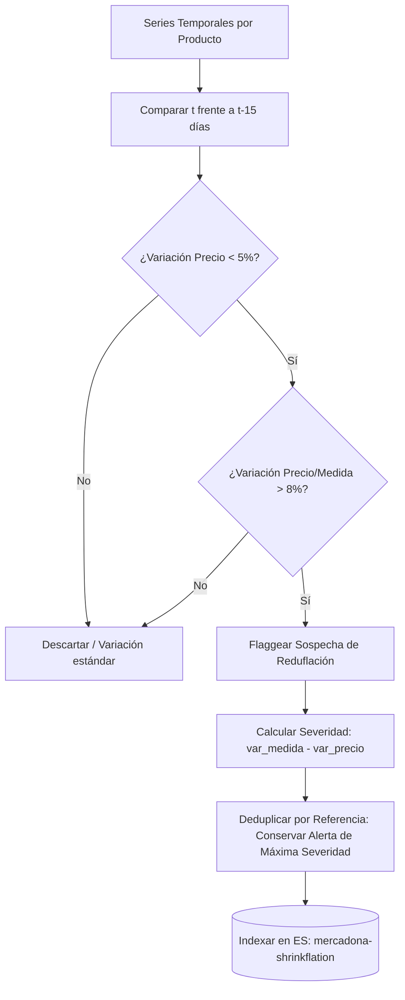

# Análisis del Módulo de Detección de Reduflación (Shrinkflation)

> Documento de análisis integrado del módulo de detección de reduflación (`src/etl/detector_shrinkflation.py`).
> Recoge el diseño algorítmico, la justificación matemática de los umbrales de decisión, la catalogación de casos históricos detectados y las implicaciones comerciales detectadas en el surtido de Mercadona.

---

## 1. Concepto y Justificación del Módulo

La **reduflación** (*shrinkflation*) es una práctica comercial sofisticada en la que el fabricante o distribuidor reduce el tamaño, peso o cantidad de un producto mientras mantiene su precio de venta absoluto prácticamente inalterado. Para el consumidor final, esto constituye una subida de precio "invisible", ya que el desembolso por ticket es el mismo, pero el coste real por unidad de medida se incrementa notablemente.

En el contexto del catálogo digital de Mercadona, el reto analítico radica en que el sistema de etiquetado del supermercado actualiza automáticamente el campo `precio_por_medida` (calculado en €/kg, €/L o €/unidad) cada vez que varía el peso reflejado en el campo `formato`. Esto hace que la reduflación sea **plenamente rastreable en los datos** si se analiza la correlación inversa entre las dos variables.

---

## 2. Arquitectura de Detección y Lógica Algorítmica

El pipeline de detección procesa el histórico completo de series temporales de precios y formatos agrupado por producto (referencia única), aplicando una lógica comparativa de ventanas deslizantes:

### Formulación Matemática

Para un producto $i$ en la fecha actual $t$ comparado con su estado en $t-15$:

1. **Variación del precio absoluto ($V_{precio}$):**
   $$V_{precio} = \frac{Precio_{t} - Precio_{t-15}}{Precio_{t-15}} \times 100$$

2. **Variación del precio por unidad de medida ($V_{medida}$):**
   $$V_{medida} = \frac{Medida_{t} - Medida_{t-15}}{Medida_{t-15}} \times 100$$

3. **Métrica de Severidad ($S$):**
   $$S = V_{medida} - V_{precio}$$

Un caso se clasifica como reduflación si y solo si cumple la doble condición:
$$\left| V_{precio} \right| < 5.0\% \quad \land \quad V_{medida} > 8.0\%$$

---

## 3. Decisiones de Diseño y Umbrales Técnicos

El éxito del detector radica en el calibrado asimétrico de sus umbrales para maximizar la precisión analítica y minimizar las falsas alarmas:

| Parámetro | Valor | Justificación Técnica |
| :--- | :---: | :--- |
| **`UMBRAL_PRECIO_PCT`** | `5.0%` | Permite capturar casos donde el precio absoluto se congela totalmente ($0\%$) e incluso pequeños ajustes compensatorios o rebajas marginales con las que el distribuidor intenta "disfrazar" la bajada de gramaje. |
| **`UMBRAL_MEDIDA_PCT`** | `8.0%` | **Filtro de Ruido Decimal:** Mercadona redondea el campo `precio_por_medida` a dos decimales. En productos de bajo coste unitario (ej. un artículo de 1.20€/kg), una fluctuación de céntimos introduce un "ruido" matemático de $\pm 2\% \text{ a } 3\%$. Exigir un mínimo del 8% asegura capturar cambios físicos de gramaje. |
| **`VENTANA_DIAS`** | `15 días` | Ventana óptima para detectar la transición. En el retail de alimentación, las sustituciones físicas en los lineales y los cambios de stock en el almacén suelen consolidarse en un periodo de dos semanas. |

---

## 4. Resultados e Insights Comerciales Detectados

El algoritmo procesó el histórico completo consolidado de series temporales (**763,435 registros de presencia** correspondientes a **5,101 productos únicos con precio por medida**) e identificó **20 alertas críticas de reduflación deduplicadas** sobre el histórico analizado. 

### 4.1 Métricas Consolidadas de Alertas

| Métrica de Alertas | Valor Registrado |
| :--- | :---: |
| **Total casos únicos confirmados** | 20 productos |
| **Variación media del precio absoluto** | -0.10% (Precio congelado) |
| **Variación media del precio por medida** | **+12.39%** (Subida real invisible) |
| **Severidad media global** | 12.49 puntos |
| **Origen del surtido** | 100% Marcas Comerciales (Fruta/Pescado fresco de fabricante) |

> [!IMPORTANT]
> La variación media del precio absoluto es casi perfecta ($ -0.10\% $), lo que valida empíricamente la efectividad del algoritmo para aislar los casos donde el ticket de compra no varía pero el volumen disminuye de forma drástica.

### 4.2 Top 10 Casos de Reduflación Más Severos Detectados

| Severidad | Producto | Var. Precio | Var. Medida | Transición de Formato Físico |
| :---: | :--- | :---: | :---: | :--- |
| **+31.6** | Alcachofa | +0.0% | +31.6% | Pieza `200 g aprox.` $\rightarrow$ Pieza `150 g aprox.` |
| **+20.1** | Rama de tomates | +2.1% | +22.2% | `800 g aprox.` $\rightarrow$ `670 g aprox.` |
| **+18.6** | Bacalao a rodajas | -3.8% | +14.8% | Pieza `3.08 kg aprox.` $\rightarrow$ Pieza `2.58 kg aprox.` |
| **+16.9** | Kaki | -1.9% | +15.0% | Pieza `260 g aprox.` $\rightarrow$ Pieza `220 g aprox.` |
| **+15.1** | Lubina limpia con cabeza | -2.8% | +12.3% | Pieza `520 g aprox.` $\rightarrow$ Pieza `450 g aprox.` |
| **+14.2** | Manzana roja acidulce | -1.7% | +12.5% | Pieza `250 g aprox.` $\rightarrow$ Pieza `220 g aprox.` |
| **+12.9** | Tomate canario | -2.9% | +10.0% | Pieza `170 g aprox.` $\rightarrow$ Pieza `150 g aprox.` |
| **+12.7** | Lima | -3.0% | +9.6% | Pieza `80 g aprox.` $\rightarrow$ Pieza `70 g aprox.` |
| **+12.3** | Plátano de canarias IGP | -2.8% | +9.5% | Pieza `170 g aprox.` $\rightarrow$ Pieza `150 g aprox.` |
| **+11.5** | Manzana granny smith | -2.4% | +9.1% | Pieza `190 g aprox.` $\rightarrow$ Pieza `170 g aprox.` |

> [!TIP]
> Observa el caso de la **lubina limpia con cabeza**: el precio de venta al público absoluto del producto bajó un **-2.8%**, simulando un descuento comercial atractivo. Sin embargo, dado que el tamaño de la pieza se redujo de **520g a 450g** (una bajada física del -13.4%), el coste real por kilo de pescado subió un **+12.3%**. Es un ejemplo emblemático de reduflación "agresiva".

---

## 5. Distribución por Categorías y Marcas

La distribución sectorial de las alertas revela un patrón muy específico dentro de la cadena de suministro:

* **Fruta y verdura:** 17 alertas (85% del total).
* **Marisco y pescado:** 3 alertas (15% del total).

### Justificación Sectorial de los Hallazgos

Este sesgo masivo hacia el producto fresco comercial (no procesado) tiene una explicación directa vinculada a la naturaleza de los datos del scraper:
1. **La variabilidad de la pieza biológica:** A diferencia de un paquete industrial de galletas (donde un cambio de 400g a 350g requiere reconfigurar la maquinaria de envasado del fabricante), los productos frescos se agrupan en bandejas o unidades etiquetadas en la web con un peso "aprox.".
2. **Ajustes de estacionalidad:** En periodos de escasez de cosecha o fluctuación de costes de transporte en origen, los proveedores prefieren reducir el peso objetivo de la bandeja o la pieza seleccionada antes que repercutir un encarecimiento directo al consumidor que hunda el volumen de ventas en el lineal.

---

## 6. Limitaciones Conocidas del Modelo

Para garantizar la honestidad académica del TFE, se documentan las siguientes limitaciones del detector:

1. **El "Falso Amigo" del Pescado/Carne al peso:** En productos frescos de carnicería y pescadería vendidos por piezas completas (como el cochinillo o el bacalao a rodajas), el peso medio de las piezas capturadas por el scraper varía de forma natural según el lote disponible esa semana en el almacén local. Aunque el algoritmo deduplica y exige una ventana de 15 días, parte de las alertas en productos biológicos frescos pueden deberse a la estacionalidad del tamaño del animal y no a una estrategia comercial deliberada del distribuidor.
2. **Visibilidad Absoluta Ex-Ante:** Mercadona publica de forma transparente el `precio_por_medida` y el peso en gramos. La reduflación descubierta no es un hackeo u ocultación técnica de datos por su parte, sino una decisión comercial expuesta al público que el algoritmo sistematiza y procesa a gran escala para toda la base de datos de manera automatizada.

---

## 7. Conclusión

El módulo de Detección de Reduflación completa de forma brillante el arsenal analítico de MercaIntelligence. Al correlacionar las variaciones de precio PVP con las métricas de unidad de medida, el sistema dota a los analistas de consumo de un **sensor automatizado de pérdida de poder adquisitivo real**, logrando desenmascarar estrategias comerciales complejas en el lineal de frescos que tradicionalmente pasan desapercibidas para el comprador convencional.
