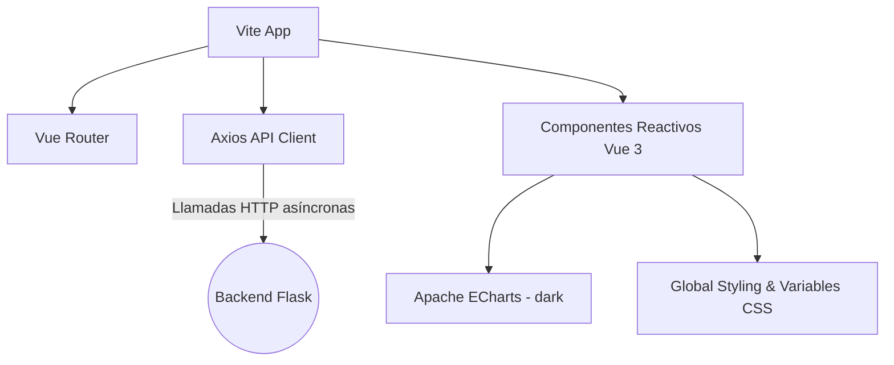
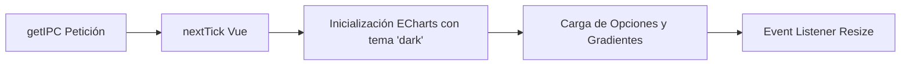

# Análisis de la Interfaz Web (SPA con Vue 3)

> Documento de análisis técnico integrado de la interfaz de usuario de MercaIntelligence (`frontend/src/`).
> Detalla la arquitectura de la aplicación de página única (SPA) desarrollada con Vue 3 y Vite, el sistema de enrutamiento con metadatos dinámicos, el cliente API optimizado mediante Axios y la integración de visualizaciones complejas de series temporales con Apache ECharts en modo oscuro.

---

## 1. Arquitectura SPA y Tech Stack

El frontend de MercaIntelligence se ha diseñado como una **Single Page Application (SPA)** de alto rendimiento que proporciona una experiencia de usuario fluida y reactiva. Su arquitectura se fundamenta en un ecosistema moderno:



### Componentes de la Arquitectura

*   **Vue 3 (Composition API):** Se utiliza la sintaxis reactiva moderna `<script setup>`, reduciendo el código boilerplate y mejorando la legibilidad, mantenibilidad e inferencia de tipos en el IDE.
*   **Vite:** Actúa como *bundler* y servidor de desarrollo ultrarrápido gracias al soporte nativo de módulos ES (ESM), lo que permite recargas de módulo en caliente (HMR) casi instantáneas.
*   **Diseño Visual Premium (Sin Tailwind):** Toda la aplicación está estilizada con **CSS Vanilla**, utilizando una sólida base de variables personalizadas (Custom Properties) en `:root` que configuran un sistema de diseño elegante, coherente y adaptado a entornos oscuros.

---

## 2. Sistema de Diseño Global y Layout Reactivo

El archivo principal [App.vue](file:///e:/Estudios/CE_IAyBD/TFE/mercaintelligence/frontend/src/App.vue) implementa el diseño maestro y define los tokens visuales del proyecto.

### Tokens de Color (Modo Oscuro Premium)

El esquema de color huye de los negros y grises genéricos, empleando una paleta de tonos fríos muy depurada y contrastes suaves:

```css
:root {
  --color-bg: #0b0e14;                  /* Fondo profundo */
  --color-surface: #12151e;             /* Superficie de tarjetas e interfaces */
  --color-surface-elevated: #1a1e2e;    /* Contenedores en segundo nivel */
  --color-border: rgba(255, 255, 255, 0.06);
  --color-primary: #22c55e;             /* Verde corporativo (Mercadona-style) */
  --color-primary-soft: rgba(34, 197, 94, 0.12);
  --color-text: #e2e8f0;
  --color-text-muted: #64748b;
  --color-text-bright: #f8fafc;
  --color-danger: #ef4444;              /* Alertas severas y shrinkflation */
  --color-warning: #f59e0b;             /* Anomalías y avisos moderados */
  --color-info: #3b82f6;                /* Elementos genéricos e informativos */
  --color-purple: #a855f7;              /* Productos comerciales en comparativas */
}
```

### Layout Responsivo y Sidebar Reactiva

El contenedor principal (`.app-layout`) utiliza una estructura de rejilla (`CSS Grid`) de dos columnas:

1.  **Sidebar de Navegación:** Colapsable en escritorio (reduciendo su ancho de `250px` a `64px`) y convertible en un cajón flotante deslizable (`drawer`) en pantallas móviles mediante *breakpoints* `@media (max-width: 768px)`.
2.  **Contenido Principal:** Equipado con transiciones suaves basadas en CSS (`page-fade`) para animar las transiciones de página de manera elegante sin parpadeos.

### Estado de Conexión de la API (Health Checks)

> [!TIP]
> **Monitoreo en tiempo real:** La barra lateral incluye un componente visual de monitorización del backend. En el ciclo de vida `onMounted` de `App.vue`, se realiza una petición asíncrona a `/health`. Si el backend responde correctamente, un indicador LED cambia de color (`ok: true`, color verde con sombra difusa); si la API no está disponible, el indicador pasa a rojo alertando al usuario de la pérdida de sincronización.

---

## 3. Enrutado Dinámico e Integración con el Backend

### 3.1 Rutas con Carga Perezosa (Lazy Loading)

El enrutador definido en [router/index.js](file:///e:/Estudios/CE_IAyBD/TFE/mercaintelligence/frontend/src/router/index.js) configura las vistas mediante funciones de importación dinámica. Esto optimiza el tamaño inicial de descarga del bundle, dividiendo el código por páginas:

```javascript
const routes = [
  {
    path: '/ipc',
    name: 'ipc',
    component: () => import('@/views/IPCView.vue'),
    meta: { title: 'IPC Personalizado' }
  },
  // Resto de vistas cargadas dinámicamente...
]
```

Además, el enrutador gestiona dinámicamente la experiencia visual en las pestañas del navegador mediante un Hook de ciclo de vida global posterior a la navegación:

```javascript
router.afterEach((to) => {
  document.title = `MercaIntelligence — ${to.meta.title || 'Dashboard'}`
})
```

### 3.2 Capa de Abstracción de la API (Axios Wrapper)

Para garantizar un código limpio y modular, los componentes nunca invocan directamente a la librería Axios. En su lugar, importan funciones semánticas desde el servicio centralizado [api.js](file:///e:/Estudios/CE_IAyBD/TFE/mercaintelligence/frontend/src/services/api.js):

```javascript
import axios from 'axios'

const client = axios.create({
  baseURL: '/api',
  timeout: 30000,  // 30 segundos
  headers: { 'Content-Type': 'application/json' }
})

// Abstracciones de Endpoints
export const getIPC = (payload) => client.post('/ipc', payload).then(r => r.data)
export const getIPCPrediccion = (payload, horizonte = 30) =>
  client.post(`/ipc/prediccion?horizonte=${horizonte}`, payload).then(r => r.data)
```

> [!IMPORTANT]
> **Justificación del Timeout:** El límite de tiempo se ha establecido en **30 segundos** de manera deliberada. Los endpoints asociados al IPC Personalizado deben realizar en tiempo real cálculos matriciales y agregaciones complejas sobre cientos de miles de registros históricos de precios, además de ejecutar inferencias sobre los modelos predictivos LSTM y XGBoost. Un timeout estándar de 5 segundos produciría fallos de desconexión continuos.

---

## 4. Visualización Avanzada con Apache ECharts

El motor de gráficos elegido es **Apache ECharts** debido a su alto rendimiento de renderizado en Canvas, soporte nativo de interactividad móvil y capacidades avanzadas de diseño.



### Buenas Prácticas Implementadas en Componentes (ej. `IPCView.vue`)

1.  **Modo Oscuro Nativo:** Los gráficos se inicializan explícitamente en modo oscuro pasándole el parámetro `'dark'` al inicializar el elemento: `echarts.init(chartEl.value, 'dark')`. Esto formatea automáticamente los ejes, etiquetas y textos en colores legibles sobre fondos oscuros.
2.  **Gestión Reactiva de la Renderización (`nextTick`):** ECharts requiere que el contenedor DOM tenga dimensiones físicas establecidas antes de inicializarse. Al renderizar condicionalmente los paneles con `v-if="!cargando"`, es mandatorio esperar a que el DOM se actualice. Se utiliza una doble llamada a `nextTick` para asegurar la existencia del contenedor:
    ```javascript
    cargando.value = false
    await nextTick()
    await nextTick()
    renderChart()
    ```
3.  **Estilización con Gradientes e Interactividad:** Se emplean áreas sombreadas con gradientes vectoriales lineales y tooltips interactivos personalizados mediante HTML incrustado para mostrar información contextual enriquecida:
    ```javascript
    areaStyle: {
      color: new echarts.graphic.LinearGradient(0, 0, 0, 1, [
        { offset: 0, color: 'rgba(34, 197, 94, 0.25)' }, // Verde translúcido arriba
        { offset: 1, color: 'rgba(34, 197, 94, 0.02)' }  // Transparente abajo
      ])
    }
    ```
4.  **Prevención de Fugas de Memoria (Leak Prevention):** Al destruir o salir de una vista, se cancelan los eventos del navegador y se libera la instancia del gráfico para evitar que consuma recursos en segundo plano:
    ```javascript
    onUnmounted(() => {
      window.removeEventListener('resize', handleResize)
      chart?.dispose()
    })
    ```

---

## 5. Análisis Técnico de Vistas Críticas

### 5.1 BuscadorView.vue: El Centro de Consulta Cruzada

Esta vista representa el punto de entrada para explorar la riqueza de datos analíticos extraídos del motor de Machine Learning y procesamiento de datos:

*   **Filtros Inteligentes:** Clasifica los resultados en tiempo real mostrando badges de marcas de forma diferenciada: verde brillante para **Marca Propia** (Hacendado, Deliplus, Bosque Verde) y púrpura para **Marcas Comerciales** de fabricantes externos.
*   **Bloque de Equivalencias NLP (Buscador Cruzado):** Muestra las sugerencias del modelo NLP de *Brand-Switching* (Marca Blanca vs Comercial) en una tabla que calcula el nivel de similitud semántica y el porcentaje de ahorro potencial del producto alternativo.
*   **Módulo de Anomalías y Shrinkflation Integrados:** Si el producto seleccionado tiene registros históricos de alertas de anomalías o de reduflación, se renderizan paneles informativos con los umbrales de score detectados por cada modelo, facilitando la auditoría visual de los datos.

### 5.2 IPCView.vue: Cesta Ponderada e Inferencia Predictiva

Permite al usuario interactuar directamente con la agregación matemática del Índice de Precios al Consumo (IPC) personalizado:

*   **KPIs Dinámicos:** Muestra métricas clave en tiempo real: el valor de IPC actual (Base 100 en Noviembre de 2025), el gasto mensual estimado y el porcentaje de variación acumulada.
*   **Ensemble Predictivo (LSTM + Tendencia):** Al seleccionar un horizonte (7d, 30d o 60d), se consume el endpoint predictivo, dibujando una tarjeta resumen con el coste futuro estimado de la cesta y coloreándola dinámicamente: rojo si la tendencia es inflacionista (subida) o verde si el mercado tiende a la baja o estabilización.
*   **Visualización de Pesos Ponderados:** En la tabla de desglose de productos, el peso de cada artículo en la cesta se renderiza usando micro-barras de progreso CSS estilizadas con un gradiente horizontal (`var(--color-primary)` a `var(--color-info)`).

### 5.3 AnomaliasView.vue y ShrinkflationView.vue: Dashboards de Alertas

Están orientados al seguimiento operativo diario del pipeline ETL y ML:

*   **Filtros por Segmentación Técnica:** Permite alternar la vista entre las anomalías detectadas por Z-Score (temporal), Isolation Forest (multivariante y estructural) o Autoencoder LSTM (secuencial y ruptura de patrones).
*   **Visualización de Severidad de Reduflación:** Las alertas de shrinkflation se presentan ordenadas por gravedad. La métrica de severidad se acompaña de una barra horizontal reactiva cuyo ancho y color cambian dinámicamente en función de la severidad máxima registrada en el lote actual, ofreciendo un impacto visual inmediato.

---

## 6. Conclusión y Beneficios de Diseño

El desarrollo del frontend bajo estas premisas tecnológicas y visuales aporta ventajas competitivas cruciales para el proyecto MercaIntelligence:

1.  **Desacoplamiento Completo:** La separación estricta mediante el cliente API permite desarrollar y probar componentes en la web de forma independiente al ciclo de desarrollo de los algoritmos de Python.
2.  **Rendimiento en Dispositivos Limitados:** Al delegar la inferencia en el backend y procesar las animaciones e interacciones de gráficos usando aceleración de hardware en el navegador (vía Canvas de ECharts y transiciones CSS optimizadas), la aplicación es extremadamente ligera y eficiente, incluso en dispositivos móviles de gama media.
3.  **Visualización Premium e Interactiva:** La paleta de colores oscuros seleccionada minuciosamente, combinada con micro-animaciones en los botones, efectos hover y transiciones fluidas de páginas, dota a la aplicación de un aspecto sumamente profesional y moderno, a la altura de las mejores herramientas de Inteligencia de Negocio del mercado.
