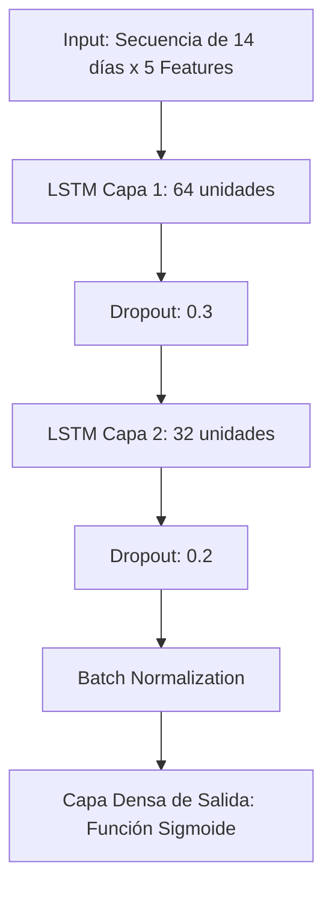

# Análisis del Módulo de Predicción de Precios (LSTM)

> Documento de análisis detallado del modelo de predicción temprana de cambios de precio (`notebooks/lstm_clasificador_colab.ipynb`).
> Recoge el diseño experimental, la arquitectura de Deep Learning aplicada a series temporales, el manejo del desbalanceo extremo y la optimización analítica de umbrales frente a modelos base (Baseline).

---

## 1. Objetivo y Diseño Experimental

El objetivo principal de este módulo es predecir de forma temprana si un producto sufrirá un cambio de precio (ya sea una subida o una bajada) en los próximos 7 días, utilizando una ventana de contexto histórica de 14 días.

Este problema presenta un **desbalanceo de clases extremo**: aproximadamente el 95.7% de las secuencias diarias no presentan cambios de precio (clase 0), mientras que solo el 4.3% corresponden a un cambio real (clase 1).

Para garantizar el rigor científico y evitar la fuga de información (*data leakage*), se implementó un **split temporal estricto de 3 vías**:

- **Train (70%)**: 460,430 secuencias (hasta el 21 de marzo de 2026). Para lidiar con el desbalanceo, se aplicó un hiperparámetro de `class_weight` que penaliza los errores en la clase minoritaria (penalización **24.3x** mayor).
- **Validación (15%)**: 96,621 secuencias (desde el 21 de marzo de 2026 hasta el 20 de abril de 2026). Empleado para la monitorización del proceso de *Early Stopping* (el cual detuvo el entrenamiento en la época 15, restaurando los pesos óptimos de la época 8) y para la calibración del umbral de decisión.
- **Test (15%)**: 101,322 secuencias (desde el 20 de abril de 2026). Reservado exclusivamente para la evaluación final y aislada del rendimiento del modelo.

---

## 2. Arquitectura de la Red Neuronal (LSTM)

El modelo construido es una red neuronal recurrente basada en celdas de Memoria a Corto y Largo Plazo (LSTM), especialmente diseñada para modelar dependencias secuenciales.

### Decisiones de Diseño Arquitectónico

- **Simplicidad para evitar Overfitting:** Dado que la entrada consiste en secuencias cortas (14 timesteps) y 5 variables (features derivadas como `variacion_pct` o `ratio_vs_subcat`), una red excesivamente profunda tendería a sobreajustarse al conjunto de entrenamiento. El modelo cuenta con **30,497 parámetros totales** (30,433 entrenables y 64 no entrenables).
- **Capas de Dropout (0.3 y 0.2):** Fundamentales como mecanismo de regularización, apagando neuronas aleatoriamente para forzar a la red a no depender de patrones espurios.
- **Batch Normalization:** Estabiliza el entrenamiento, un paso crítico cuando se utilizan gradientes fuertemente alterados por los `class_weights` del desbalanceo.

---

## 3. Optimización Analítica del Umbral (Threshold)

El uso de `class_weight` durante el entrenamiento distorsiona la distribución de las probabilidades de salida; el modelo tenderá a ser más "pesimista" (prediciendo más 1s para evitar la dura penalización), por lo que el umbral clásico de `0.5` deja de ser la frontera geométrica ideal.

Para transformar estas probabilidades brutas en un sistema de alertas de negocio útil (sin inundar a los analistas de falsos positivos), se realizó un análisis sobre la **Curva Precision-Recall** en el conjunto de validación.
A través de esta calibración, se extrajo matemáticamente el **Threshold Óptimo (0.901)** (exactamente 0.9009), el cual representa el punto exacto que **maximiza el F1-Score** en validación (alcanzando un **F1 esperado de 0.769**, con una **precisión del 85.2%** y un **recall del 70.2%**). Este umbral fue el que finalmente se evaluó frente al conjunto de Test.

---

## 4. Resultados y Comparativa vs Baseline

Para validar el valor añadido del Deep Learning, el LSTM calibrado se comparó contra un modelo base estadístico (Regresión Logística), evaluado bajo la misma metodología de partición y optimización de umbrales.

| Modelo | Precision | Recall | F1-score | AUC-ROC |
| :--- | :---: | :---: | :---: | :---: |
| **LSTM** | **0.207** | **0.624** | **0.311** | **0.893** |
| Regresión Logística (baseline) | 0.156 | 0.279 | 0.201 | 0.771 |

> [!IMPORTANT]
> **Superioridad Recurrente:** El LSTM alcanza un asombroso AUC-ROC de **0.893** (frente al 0.771 de la Regresión Logística), demostrando que la red extrae interacciones temporales no lineales que se pierden al aplanar los datos.

### Conclusiones del Rendimiento

1. **Equilibrio Operativo (Precision-Recall):** Tras optimizar el umbral, el LSTM detecta **más de 3 de cada 5 cambios reales** (Recall del 62.4%), manteniendo la precisión en un **20.7%** (aproximadamente 1 de cada 5 alertas generadas resulta en un acierto). Por el contrario, el modelo base colapsa en su *Recall* (27.9%), ignorando la mayor parte de los eventos del mercado.
2. **Impacto de Negocio:** El pipeline final ha generado y exportado **658,373 predicciones históricas** (desde el 24/11/2025 hasta el 13/05/2026) cubriendo **4,858 productos únicos** al archivo particionado [lstm_resultados.parquet](../../../data/predicciones/lstm/lstm_resultados.parquet). Del total de inferencias históricas, el modelo generó **31,054 alertas de cambio de precio** (4.7% del volumen total) utilizando el umbral calibrado de 0.901, identificando **3,884 productos únicos con al menos un cambio próximo predicho**. Se consolida así una herramienta de **inteligencia competitiva**, capaz de anticipar y alertar sobre movimientos en los precios de la competencia días antes de que sucedan, ofreciendo una ventaja estratégica accionable y equilibrada.
