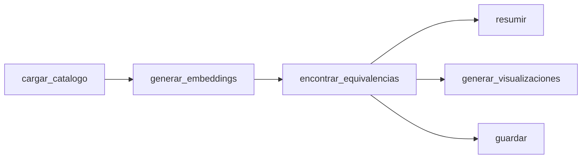

# Análisis del Pipeline NLP de Equivalencias Semánticas

> Documento de análisis integrado del módulo `src/ml/nlp_embeddings.py`.
> Recoge el proceso iterativo de diseño, validación y refinamiento del sistema de detección
> de equivalencias entre productos de marca propia y marca comercial en el catálogo de Mercadona.

---

## 1. Arquitectura del Pipeline

El sistema sigue una arquitectura de pipeline secuencial con cinco fases:



### Decisiones de diseño clave

| Decisión | Justificación |
|----------|---------------|
| **Eliminar marca del título** antes de generar embeddings | Evita que el coseno mida afinidad de marca en vez de similitud de producto. Sin esto, "leche hacendado" tendría mayor similitud con "yogur hacendado" que con "leche puleva" |
| **Concatenar el formato al título** para generar embeddings | Evita la colisión de representaciones semánticas idénticas en productos con el mismo nombre pero diferente tamaño/envase (ej: Leche 1L vs Leche Pack 6x1L), permitiendo un emparejamiento mucho más preciso a nivel de SKU. |
| **Restricción por subcategoría** | Evita falsos matches inter-categoría (ej: "leche" ↔ "yogur" por compartir vocabulario lácteo) |
| **`normalize_embeddings=True`** | Permite calcular similitud coseno como producto escalar, mejorando rendimiento sin perder precisión |
| **TOP_K=3 + umbral 0.75** | Doble filtro: ranking + mínimo de calidad semántica. Garantiza que solo se conserven matches con alta similitud |
| **`MIN_COMERCIALES=3`** | Exige al menos 3 productos comerciales por subcategoría, evitando el "monopolio de match" (ver §4) |
| **Filtro `misma_unidad`** | Solo calcula brecha de precio por medida cuando ambos productos usan la misma unidad (€/kg con €/kg, €/L con €/L), evitando comparaciones absurdas |

---

## 2. Resultados de Matching

### 2.1 Métricas globales

| Métrica | Valor |
|---------|:-----:|
| Productos en catálogo | 4,312 |
| Marca propia | 2,858 |
| Marca comercial | 1,454 |
| Equivalencias top-1 | **924** |
| Cobertura (top-1 / MP) | 32.3% |
| Similitud media | **0.844** |
| Similitud mínima | 0.750 |

> [!TIP]
> Una similitud media de **0.844** con `paraphrase-multilingual-MiniLM-L12-v2` sobre textos cortos en español es un resultado muy sólido. Confirma que el modelo captura adecuadamente la semántica del dominio de supermercado.

### 2.2 Métricas económicas

| Métrica | Valor |
|---------|:-----:|
| Pares comparables (misma unidad) | **892** de **924** (32 excluidos) |
| Precio/medida medio marca propia | 5.23€ |
| Precio/medida medio marca comercial | 7.21€ |
| **Diferencia mediana (por medida)** | **+49.0%** |
| Diferencia media (por medida) | +82.6% |
| Diferencia media (precio absoluto) | +70.2% |

> [!IMPORTANT]
> Se utiliza la **mediana** (+49.0%) como estadístico principal por ser robusta frente a outliers. La media (+82.6%) es más alta por la influencia de subcategorías con grandes primas de marca legítimas (cosmética, limpieza).

---

## 3. Proceso de Refinamiento Económico

El cálculo de la brecha de precios pasó por cuatro iteraciones antes de alcanzar la versión actual. Cada iteración resolvió un sesgo detectado en la anterior.

### Iteración 1: Precio absoluto (versión inicial)

```
Diferencia media: +73.2%
```

**Problema detectado:** Comparar precios absolutos (€) distorsiona las brechas cuando los formatos son distintos. Un pack de 6 unidades de marca propia cuesta más que una unidad suelta de marca comercial, pero *por unidad* es más barato.

**Ejemplo:** "Perro" mostraba una brecha de **-60%** (marca propia más cara), lo cual era un artefacto de comparar un saco grande con un paquete pequeño.

### Iteración 2: Precio por unidad de medida

```
Diferencia media: +173.5%
```

**Problema detectado:** Al usar `precio_por_medida` directamente, se comparaban unidades incompatibles: €/ud con €/L (toallitas vs líquido = +23,100%), €/100g con €/kg, €/lavado con €/ud.

**Dato clave:** Solo 53 de 882 pares (6%) tenían unidades distintas, pero generaban casi todos los outliers extremos.

| Combinación de unidades | N pares | Dif. media |
|:-:|:-:|:-:|
| L vs kg | 13 | +762% |
| 100g vs kg | 6 | +1,017% |
| ud vs L | 1 | +23,100% |

### Iteración 3: Filtro de misma unidad

```
Diferencia media:   +80.3%
Diferencia mediana: +45.6%
```

**Problema detectado:** Seguían apareciendo anomalías causadas por subcategorías con muy pocos productos comerciales (1-2), donde todos los productos de marca propia se emparejaban con el mismo producto comercial, a menudo uno premium o atípico.

### Iteración 4: Mínimo de variedad comercial (versión final)

```
Diferencia media:   +82.6%
Diferencia mediana: +49.0%
```

Con `MIN_COMERCIALES=3`, se eliminan las subcategorías sin variedad suficiente. La mediana sube de +45.6% a +49.0% porque los pares eliminados eran los de "monopolio de match" que distorsionaban hacia abajo.

---

## 4. Anomalías Investigadas y Resueltas

### 4.1 Patrón "Monopolio de Match"

Se identificó un patrón común en múltiples subcategorías: cuando solo hay 1-2 productos comerciales, todos los productos de marca propia se emparejan con ese único producto, generando brechas artificiales.

| Subcategoría | N COM | Producto COM | Efecto | Resolución |
|---|:-:|---|---|---|
| Helados | 1 | Cucurucho fresa nata (3.40€/L) | Bombones premium (-60%) parecen más caros | Eliminado por `MIN_COMERCIALES` |
| Mantequilla | 1 | Flora Proactiv (14.18€/kg) | Margarina básica (+373%) parece absurda | Eliminado por `MIN_COMERCIALES` |
| Sal | 1 | Escamas Polasal (16€/kg) | Sal gruesa (+3900%) vs producto gourmet | Eliminado por `MIN_COMERCIALES` |

### 4.2 Caso Helados: marca propia aparentemente más cara

Todos los helados Hacendado (22 productos) se emparejaban con un único producto comercial: "helado cucurucho fresa nata" a 3.40€/L. Los helados tipo bombón (chocolate, almendras) costaban 7-8€/L — no porque sean más caros que la marca comercial, sino porque son **productos de gama superior** comparados con un cucurucho básico.

| Producto Hacendado | €/L MP | €/L COM | Dif. |
|---|:-:|:-:|:-:|
| Bombón doble chocolate | 8.55 | 3.40 | -60% |
| Cucurucho choco nata | 3.40 | 3.40 | 0% |
| Helado de vainilla | 2.40 | 3.40 | +42% |

**Diagnóstico:** El match semántico es correcto ("helado" ↔ "helado"), pero sin variedad comercial no hay equivalentes funcionales adecuados.

### 4.3 Caso Limpieza Vajilla: match semántico correcto, equivalencia funcional incorrecta

5 de 7 productos "lavavajillas a mano" de Bosque Verde se emparejaban con "limpiamáquinas lavavajillas Finish" (15€/L) — un producto de mantenimiento de la máquina, no un lavavajillas de uso diario.

| Producto MP | Producto COM | Dif. | Diagnóstico |
|---|---|:-:|---|
| Lavavajillas a mano BV | Limpiamáquinas Finish | +1,459% | Productos distintos |
| Lavavajillas gel máquina BV | Somat gel 5en1 | +49% | Correcto |
| Limpiamáquinas BV | Limpiamáquinas Finish | +142% | Correcto |

**Diagnóstico:** El NLP acierta semánticamente (comparten la palabra "lavavajillas") pero son productos funcionalmente distintos. Esta es una limitación inherente del matching por texto que se documenta como tal.

### 4.4 Caso Otras Salsas: mezcla de matches buenos y malos

18 pares divididos en dos grupos claramente separados:

- **Tomate frito Hacendado ↔ Hida** (7 pares, sim >0.96): matches excelentes con brecha legítima de +97% mediana
- **Salsas variadas ↔ Salsa de trufa** (11 pares): la trufa a 38.75€/kg es un producto gourmet de nicho que infla todas las brechas

---

## 5. Subcategorías con Mayor Brecha: Validación

Tras aplicar todos los filtros, las subcategorías con mayor brecha mediana fueron investigadas individualmente para separar las anomalías de los insights de negocio reales:

| Subcategoría | Mediana | N pares | Veredicto |
|---|:-:|:-:|---|
| Limpieza vajilla | +517.2% | 7 | 🔴 Inflada por match funcional incorrecto (lavavajillas ↔ limpiamáquinas) |
| Limpieza muebles y multiusos | +258.1% | 2 | 🟡 Real pero poco representativa (solo 2 pares) |
| **Detergente y suavizante ropa** | **+191.2%** | **13** | 🟢 **Legítima** — Ariel cuesta 2-7x más por lavado que Bosque Verde |
| **Yogures líquidos** | **+190.7%** | **20** | 🟢 **Legítima** — Actimel/Danacol vs Hacendado (l-casei y cuidacol) |
| Harina y preparado repostería | +178.3% | 2 | 🟡 Mixta: harina de garbanzo incorrecta (+95%), impulsor Royal perfecto (+262%) |

### 5.1 Detergente: ejemplo de insight de volumen y dosis

| Bosque Verde | Ariel | €/lavado BV | €/lavado Ariel | Dif. |
|---|---|:-:|:-:|:-:|
| Det. prendas delicadas | Ariel líquido | 0.038 | 0.265 | +597% |
| Det. frescura | Ariel líquido | 0.068 | 0.265 | +290% |
| Det. de color líquido | Ariel líquido | 0.096 | 0.265 | +176% |
| Det. blanca y color cáps. | Ariel Pods | 0.194 | 0.384 | +98% |

Todos miden en €/lavado (la unidad de dosis correcta para detergentes), con similitudes >0.89. La brecha es real, significativa y legítima, reflejando el posicionamiento premium del fabricante de marca comercial.

### 5.2 Yogures líquidos: la alternativa funcional de marca propia (L-Casei / Cuidacol)

Esta subcategoría destaca por la excelente calidad del matching semántico y la nitidez de su equivalencia de negocio:

| Hacendado (Marca Propia) | Danone (Marca Comercial) | Similitud | €/L MP | €/L COM | Dif. |
|---|---|:-:|:-:|:-:|:-:|
| L-Casei Natural 0% mg | Actimel Natural 0% mg | **0.985** | 2.17 | 4.99 | +130.4% |
| L-Casei Fresa 0% mg | Danacol Fresa 0% mg | **0.980** | 2.17 | 5.45 | +151.5% |
| Cuidacol Fresa 0% azúcares | Danacol Fresa 0% mg | **0.963** | 3.13 | 5.45 | +74.4% |
| Cuidacol Natural 0% azúcares | Actimel Natural 0% mg | **0.961** | 3.13 | 4.99 | +59.7% |

El NLP asocia perfectamente las variantes funcionales equivalentes (L-Casei ↔ Actimel y Cuidacol ↔ Danacol). El análisis de precios revela que la alternativa comercial llega a costar hasta un **151.5% más por litro** que la opción de marca propia para el mismo beneficio de salud percibido, lo que constituye un insight muy potente para el consumidor.

### 5.3 Arroz: ejemplo de match limpio y estándar

| Hacendado (Marca Propia) | Comercial | Similitud | €/kg MP | €/kg COM | Dif. |
|---|---|:-:|:-:|:-:|:-:|
| Arroz redondo | Arroz redondo La Fallera | **0.954** | 1.20 | 1.69 | +40.8% |
| Arroz largo | Arroz redondo La Fallera | **0.938** | 1.25 | 1.69 | +35.2% |
| Arroz redondo J Sendra | Arroz redondo La Fallera | **0.936** | 1.60 | 1.69 | +5.6% |
| Arroz basmati aromático | Arroz redondo sabor La Cigala | **0.919** | 2.10 | 2.45 | +16.7% |

El par **arroz redondo Hacendado (1.20€/kg) vs La Fallera (1.69€/kg) = +40.8%** (con similitud semántica de 0.954) constituye el ejemplo de match directo más limpio del catálogo: misma unidad, misma categoría y productos plenamente intercambiables sin sesgo por formato de envase.

---

## 6. Filtros Descartados

Se evaluaron y rechazaron dos propuestas de filtrado adicional:

### Filtro por palabras conflictivas — Descartado

Crear listas de pares de palabras incompatibles (ej: "lavavajillas" / "limpiamáquinas") es ad-hoc y no generalizable. Además, puede eliminar matches legítimos: el par "salsa fresca trufa hacendado" ↔ "salsa de trufa" tiene similitud 0.959 y es un match correcto.

### Filtro por brecha >300% — Descartado

Eliminaría insights legítimos junto con los errores:

| Par eliminado | Dif. | ¿Legítimo? |
|---|:-:|:-:|
| Det. prendas delicadas BV vs Ariel | +597% | Sí |
| Abrillantador BV vs Finish | +517% | Sí |
| Lavavajillas mano BV vs limpiamáquinas Finish | +1,459% | No |

Un filtro ciego sacrifica insights reales por eliminar errores que la mediana ya absorbe.

---

## 7. Distribución General de Calidad

```
Cuartiles de diferencia por medida (%):
  25%     +3.7%
  50%    +49.0%    ← mediana (métrica principal)
  75%   +108.7%
  
Pares en rango razonable (-50% a +200%):  ~89%
Pares con dif > 200%:                     ~7%
Pares con dif < -50%:                     ~4%
```

El 89% de los pares producen brechas en un rango razonable. Los outliers restantes son mayoritariamente legítimos (primas de marca reales en cosmética, limpieza) o limitaciones del matching semántico documentadas.

---

## 8. Limitaciones Conocidas

1. **Equivalencia semántica ≠ equivalencia funcional.** El matching por texto no distingue entre productos que comparten vocabulario pero tienen funciones distintas (lavavajillas de uso diario vs limpiamáquinas).

2. **Sesgo hacia la marca comercial disponible.** En subcategorías con pocos productos comerciales, todos los matches se concentran en 1-2 productos, que pueden no ser representativos del segmento. Se mitiga con `MIN_COMERCIALES ≥ 3`.

3. **Sensibilidad al denominador.** El cálculo porcentual `(COM - MP) / MP × 100` amplifica diferencias cuando el precio/medida de MP es muy bajo. Se mitiga usando la mediana como estadístico principal.

4. **Granularidad de subcategoría.** Algunas subcategorías son demasiado amplias (ej: "otras salsas" incluye tomate frito, pesto, trufa) o demasiado estrechas (ej: "helados" con 1 producto comercial).

---

## 9. Conclusión

El pipeline produce **924 equivalencias semánticas** con una similitud media de **0.844**, de las cuales **892 son directamente comparables** por precio/medida.

La conclusión económica principal:

> **La marca comercial es, en mediana, un 49.0% más cara por unidad de medida que su equivalente de marca propia**, validado mediante similitud semántica ≥ 0.75 entre productos de la misma subcategoría.

Los filtros implementados — misma unidad de medida, mínimo de 3 productos comerciales por subcategoría, y mediana como estadístico principal — garantizan que esta cifra sea robusta y defensible.

---

## 10. Visualizaciones

### Distribución de similitud coseno


La distribución muestra densidad principal entre 0.78-0.90 con cola hasta 1.0. El pico justo sobre el umbral (0.75-0.78) indica matches borderline que se podrían filtrar subiendo el umbral a 0.80 para un dashboard de producción.

### Brecha de precio por subcategoría


La gráfica de barras horizontales muestra la mediana de brecha por medida para las 10 subcategorías con más pares, usando solo pares con misma unidad de medida. Todas las barras son positivas tras la aplicación de los filtros de calidad.

### Proyección t-SNE


La proyección 2D de los embeddings confirma que el modelo entiende el dominio: productos de la misma subcategoría se agrupan en clusters compactos (coloración cabello, chocolate, cerveza, perfumes), validando la metodología de matching por subcategoría.
