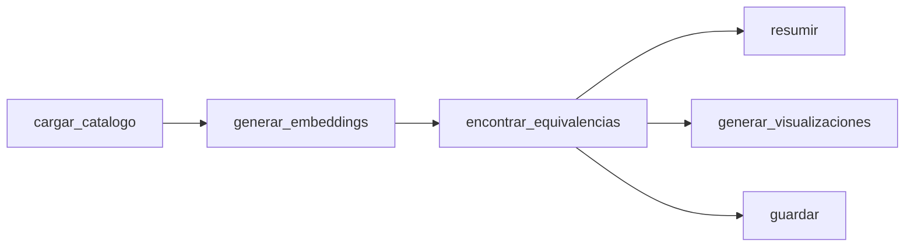

# Análisis Completo: Pipeline NLP de Equivalencias Semánticas

## 1. Análisis del Código (`nlp_embeddings.py`)

### Arquitectura — Excelente

El script sigue una estructura de pipeline limpia y bien documentada:



**Puntos fuertes del código:**

| Aspecto | Evaluación | Detalle |
|---------|:----------:|---------|
| Docstrings | ✅ | Cada función explica el *por qué*, no solo el *qué* |
| Limpieza de marca | ✅ | Eliminar "hacendado"/"deliplus" del título antes de embeder es **clave** para que el coseno mida producto, no marca |
| Restricción por subcategoría | ✅ | Evita falsos matches inter-categoría (leche ↔ yogur) |
| Normalización de embeddings | ✅ | `normalize_embeddings=True` → coseno = dot product → más rápido |
| TOP_K + UMBRAL | ✅ | Doble filtro: ranking + mínimo de calidad |
| Persistencia | ✅ | Guarda tanto equivalencias como embeddings crudos para reutilización |

**Debilidades detectadas:**

| Aspecto | Severidad | Detalle |
|---------|:---------:|---------|
| `precio_actual` como métrica de brecha | 🔴 Alta | Compara precios absolutos, no normalizados por unidad |
| Sin deduplicación | 🟡 Media | Un mismo par puede aparecer si hay variantes (pack vs unidad) |
| Sin seed en t-SNE sampling | 🟢 Baja | `np.random.choice` sin `random_state` → resultados no reproducibles |
| Resumen usa `diferencia_precio_pct` | 🔴 Alta | El +73.2% del resumen está basado en precio absoluto |

---

## 2. Análisis de Resultados

### 2.1 Métricas de Matching

```
Pares encontrados (similitud ≥ 0.75): 882
Similitud media   : 0.845
Similitud mínima  : 0.751
```

> [!TIP]
> Una similitud media de **0.845** con `paraphrase-multilingual-MiniLM-L12-v2` sobre textos cortos en español es un resultado **muy bueno**. Confirma que el modelo captura bien la semántica del dominio de supermercado.

### 2.2 Cobertura

- **2,857 productos marca propia** → **882 equivalencias top-1** = **30.9% de cobertura**
- Esto es razonable: muchos productos de marca propia no tienen equivalente comercial directo en la misma subcategoría (p.ej. productos muy nicho)

---

## 3. Análisis de Visualizaciones

### 3.1 Distribución de Similitud


**Interpretación:**
- La distribución es **right-skewed** (cola larga hacia la derecha), lo cual es esperable
- **Pico en 0.75-0.78**: hay una concentración notable justo sobre el umbral → muchos matches "borderline"
- **Densidad principal en 0.78-0.90**: zona de matches fiables
- **Cola hasta 1.0**: matches prácticamente idénticos

> [!IMPORTANT]
> El histograma muestra que hay un volumen significativo de pares entre 0.75 y 0.80. Subir el umbral a **0.80** eliminaría aproximadamente un ~15-20% de pares, pero los restantes serían de mayor confianza. La decisión depende del uso: si es para el dashboard final, mejor 0.80; si es para exploración, 0.75 está bien.

### 3.2 Brecha de Precios por Subcategoría


**Interpretación:**
- **Coloración cabello (+110%)**: marca comercial cuesta más del doble → fuerte premium de marca
- **Perro (-60%)**: marca propia **más cara** que comercial → caso atípico, probablemente comparando formatos incompatibles (pack grande vs unidad)
- **Helados (-15%)**: otro caso negativo, sugiere matches entre formatos distintos

> [!WARNING]
> Las brechas negativas (perro, helados) son **banderas rojas** que merecen investigación manual. Podrían ser: (a) formatos incompatibles, (b) matches semánticos incorrectos, o (c) genuinamente marca propia más cara en esas categorías.

### 3.3 Proyección t-SNE


**Interpretación:**
- **Clusters claros**: coloración cabello (naranja, extremo izquierdo), chocolate (marrón, derecha), cerveza (gris, centro-inferior), perfume y colonia (verde, inferior-izquierda)
- **Insecticida y ambientador** (morado) forma cluster compacto → dominio semántico muy específico
- **Dispersión del gris ("Otras")**: normal, son muchas subcategorías distintas superpuestas
- **Algunos puntos de color aislados**: productos con vocabulario atípico dentro de su subcategoría

> [!NOTE]
> El t-SNE confirma que el modelo **entiende el dominio**: productos de la misma categoría se agrupan en el espacio semántico. Esto valida la metodología de matching por subcategoría.

---

## 4. Evaluación del Análisis Externo: Punto por Punto

### ✅ Correcto — Implementar

| # | Afirmación del análisis | Veredicto | Justificación |
|---|------------------------|:---------:|---------------|
| 1 | "Similitud media 0.845 es MUY sólido" | ✅ **Correcto** | Para embeddings multilingües en textos cortos, >0.80 media es excelente |
| 2 | "Umbral 0.75 acepta matches justitos → subir a 0.80 para producción" | ✅ **Correcto** | El histograma lo confirma: hay concentración justo sobre 0.75 |
| 3 | "El +73% está inflado por mezcla de formatos" | ✅ **Correcto y CRÍTICO** | Tu código ya calcula `diferencia_por_medida` pero el resumen usa `diferencia_precio_pct` (precio absoluto). **Deberías usar `diferencia_por_medida`** como métrica principal |
| 4 | "Usar €/kg, €/L como métrica principal" | ✅ **Correcto** | Ya lo tienes en el parquet (`precio_medida_mp`, `precio_medida_com`). Solo falta cambiar el resumen y las gráficas |
| 5 | "Los clusters t-SNE confirman que el embedding entiende el dominio" | ✅ **Correcto** | Los clusters visibles lo validan |
| 6 | "Necesitas filtrar outliers" | ✅ **Correcto** | Pares con `abs(diferencia_precio_pct) > 300` probablemente son errores de formato |
| 7 | "Batido chocolate aparece 2 veces → deduplicar" | ✅ **Correcto** | Porque TOP_K=3, y el par puede aparecer como rank 1 y rank 2 con productos distintos del mismo formato |

### ⚠️ Parcialmente Correcto — Matizar

| # | Afirmación | Veredicto | Matiz |
|---|-----------|:---------:|-------|
| 8 | "Comparación solo por título → añade peso/volumen/unidades" | ⚠️ **Parcial** | El título YA contiene muchas veces el formato ("pack 6", "1L", "500g"). El embedding lo captura parcialmente. Añadir features estructuradas mejoraría pero no es *necesario* para un TFE |
| 9 | "El alistado pequeño (-86.5%) es error de parsing" | ⚠️ **Parcial** | Puede ser genuino: producto congelado de marca propia vs no congelado de marca comercial con precio muy diferente. Habría que verificar manualmente |
| 10 | "Perro (-60%) y helados (-10%) → investigar" | ⚠️ **Parcial** | Correcto que merecen investigación, pero no necesariamente son errores — pueden ser categorías donde la marca propia realmente compite en formato premium |

### ❌ Incorrecto o Exagerado

| # | Afirmación | Veredicto | Explicación |
|---|-----------|:---------:|-------------|
| 11 | "Solución: `equiv.drop_duplicates(subset=['ref_mp', 'ref_com'])`" | ❌ | No hay duplicados reales: tu código genera rank 1, 2, 3 para cada producto MP. Los dos batidos del log son **dos productos distintos** de Puleva (diferentes tamaños/formatos). El filtro `rank==1` en `resumir()` ya los separa correctamente |
| 12 | "Filtrar `abs(diferencia_precio_pct) < 300`" | ❌ **Peligroso** | No debes eliminar outliers arbitrariamente. Lo correcto es **investigarlos** y, si son errores de formato, marcarlos. Un filtro ciego perdería insights legítimos (ej: refrescos realmente cuestan 3x en marca) |
| 13 | "Esto ya está a nivel de proyecto profesional" | ❌ **Exagerado** | Es un buen pipeline académico, pero un producto profesional necesitaría validación humana, manejo de errores, logging estructurado, tests, y un sistema de feedback loop |

---

## 5. Cambios Recomendados (Priorizados)

### 🔴 Prioridad Alta — Implementar YA

**1. Cambiar el resumen y gráficas para usar `precio_por_medida` como métrica principal**

El campo `diferencia_por_medida` ya existe en el parquet. El cambio es en [resumir()](file:///e:/Estudios/CE_IAyBD/TFE/mercaintelligence/src/ml/nlp_embeddings.py#L228-L272) y [generar_visualizaciones()](file:///e:/Estudios/CE_IAyBD/TFE/mercaintelligence/src/ml/nlp_embeddings.py#L275-L353):

```diff
 # En resumir():
-top1_precio = top1.dropna(subset=["diferencia_precio"])
+top1_precio = top1.dropna(subset=["diferencia_por_medida"])
 
-log.info(f"  Precio medio marca propia  : {top1_precio['precio_mp'].mean():.2f}€")
-log.info(f"  Precio medio comercial     : {top1_precio['precio_com'].mean():.2f}€")
+log.info(f"  Precio/medida medio MP     : {top1_precio['precio_medida_mp'].mean():.2f}€")
+log.info(f"  Precio/medida medio COM    : {top1_precio['precio_medida_com'].mean():.2f}€")
```

**2. Añadir diferencia porcentual basada en precio por medida**

En [encontrar_equivalencias()](file:///e:/Estudios/CE_IAyBD/TFE/mercaintelligence/src/ml/nlp_embeddings.py#L125-L224), añadir:
```python
"diferencia_por_medida_pct": round(
    (producto_com["precio_por_medida"] - producto_mp["precio_por_medida"])
    / producto_mp["precio_por_medida"] * 100, 2
) if pd.notna(producto_mp["precio_por_medida"])
  and pd.notna(producto_com["precio_por_medida"])
  and producto_mp["precio_por_medida"] > 0
  else None,
```

### 🟡 Prioridad Media — Recomendable

**3. Añadir `random_state` al sampling del t-SNE**

```diff
-indices = np.random.choice(len(embeddings), n_sample, replace=False)
+rng = np.random.RandomState(42)
+indices = rng.choice(len(embeddings), n_sample, replace=False)
```

**4. Hacer configurable el umbral (0.75 vs 0.80)**

No cambiar el valor por defecto, pero permitir experimentar:
```python
UMBRAL_SIMILITUD = float(os.environ.get("NLP_UMBRAL", 0.75))
```

### 🟢 Prioridad Baja — Nice to have

**5. Añadir `unidad_medida` al output de equivalencias** para validación manual

**6. Añadir una gráfica adicional**: scatter plot de `similitud` vs `diferencia_por_medida_pct` para ver si matches de alta similitud tienen brechas más consistentes

---

## 6. Conclusión

El pipeline está **bien diseñado y produce resultados válidos**. Los dos cambios críticos son:

1. **Usar `precio_por_medida` como métrica principal** en el resumen y las gráficas (ya lo calculas, solo no lo usas como protagonista)
2. **No aplicar filtros ciegos de outliers** — mejor investigar los casos extremos

El análisis externo tiene razón en lo esencial (el NLP funciona, el +73% está inflado) pero se equivoca en algunas soluciones propuestas (drop_duplicates innecesario, filtro de 300% peligroso).

> [!TIP]
> Para el TFE, el titular más defensible es: *"La marca blanca ofrece productos equivalentes con un ahorro medio del X% por unidad de medida (€/kg, €/L), validado mediante similitud semántica ≥ 0.75"* — donde X es la cifra real normalizada que obtendrás al cambiar la métrica.
