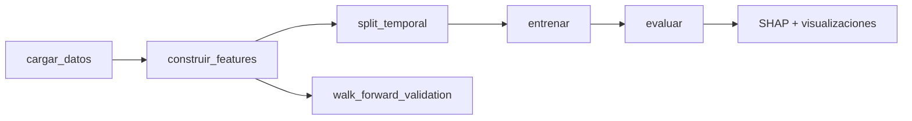
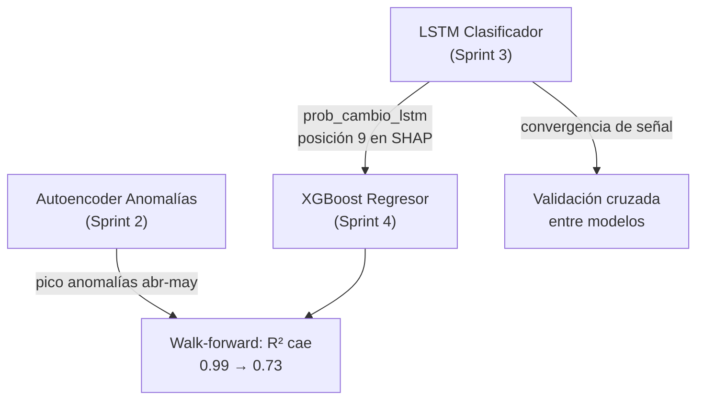

# Análisis del Modelo XGBoost de Predicción de Precios

> Documento de análisis integrado del módulo `src/ml/xgboost_prediccion.py`.
> Recoge el diseño, la evaluación rigurosa contra baseline naive, la interpretación
> mediante SHAP values, la validación temporal walk-forward y las conexiones con
> los demás módulos del pipeline (LSTM clasificador, Autoencoder de anomalías).

---

## 1. Arquitectura del Modelo

El módulo implementa un pipeline de regresión temporal con cinco fases:



### Diseño ensemble: LSTM + XGBoost

El sistema de predicción se articula como un **ensemble de dos modelos independientes** con roles complementarios:

| Modelo | Tarea | Tipo | Pregunta que responde |
|---|---|---|---|
| **LSTM** (Sprint 3) | Clasificación binaria | Deep Learning | ¿**Habrá** cambio de precio en los próximos 7 días? |
| **XGBoost** (Sprint 4) | Regresión sobre precio | Gradient Boosting | ¿**Cuánto** costará el producto dentro de 7 días? |

La probabilidad de cambio generada por el LSTM (`prob_cambio_lstm`) se integra como feature del XGBoost, creando un flujo de información unidireccional entre ambos modelos.

### Decisiones de diseño clave

| Decisión | Justificación |
|----------|---------------|
| **XGBoost sobre ARIMA/Prophet** | Los precios de Mercadona no son series estacionarias — tienen estructura de "escalón" (constantes durante semanas, cambios discretos). Los árboles de decisión son insensibles a esta estructura sin necesidad de transformaciones |
| **Horizonte de 7 días** | Coincide con el horizonte del LSTM para que ambos modelos sean directamente comparables y combinables |
| **Split temporal estricto (80/20)** | Evita data leakage temporal. Los mismos productos aparecen en train y test por diseño — el objetivo es predecir precios futuros de productos existentes, no de productos nuevos |
| **Early stopping con validation interna** | El 15% final del train se reserva como validación para detener el entrenamiento cuando el modelo deja de mejorar, evitando sobreajuste |
| **21 features en 5 categorías** | Mezcla de features temporales (lags, rolling), contextuales (días desde cambio), del producto (categoría, marca), de calendario (día/mes) y del LSTM (probabilidad de cambio) |
| **Baseline naive como referencia** | Comparación obligatoria contra el predictor trivial `pred = precio_actual` — imprescindible para cuantificar el valor real del modelo |

---

## 2. Feature Engineering

### 2.1 Catálogo de features

Se construyen 21 features organizadas en cinco familias:

| Familia | Features | Descripción |
|---|---|---|
| **Lags de precio** | `precio_lag_1`, `lag_3`, `lag_7`, `lag_14`, `lag_30` | Precio del producto hace N días — los predictores más directos |
| **Rolling statistics** | `media_7d`, `std_7d`, `media_14d`, `std_14d`, `min_14d`, `max_14d` | Estadísticas de ventana deslizante — capturan nivel y volatilidad reciente |
| **Contexto temporal** | `tendencia_14d`, `dias_desde_cambio`, `n_cambios_total` | Pendiente reciente y frecuencia histórica de cambios |
| **Producto** | `precio_por_medida`, `categoria_enc`, `marca_enc`, `es_marca_propia` | Características estáticas del producto |
| **Calendario** | `dia_semana`, `mes` | Estacionalidad potencial |
| **LSTM** | `prob_cambio_lstm` | Probabilidad de cambio predicha por el modelo LSTM independiente |

### 2.2 Integración del LSTM

La carga de datos fusiona automáticamente los resultados del LSTM clasificador:

```python
df_lstm = pd.read_parquet("data/predicciones/lstm/lstm_resultados.parquet")
df = df.merge(df_lstm, on=["referencia", "fecha"], how="left")
```

Cuando no existe predicción LSTM para un par (referencia, fecha), se imputa `prob_cambio_lstm = 0.0` — equivalente a "sin indicación de cambio". Esto permite que el pipeline funcione independientemente del LSTM.

---

## 3. Resultados: XGBoost vs Baseline Naive

### 3.1 Evaluación global

| Métrica | XGBoost | Baseline Naive | Diferencia |
|---|---|---|---|
| MAE (€) | 0.1462 | **0.0227** | Naive 6.4× mejor |
| RMSE (€) | 5.6469 | **0.1923** | Naive 29× mejor |
| R² | 0.7304 | **0.9997** | Naive gana |
| MAPE (%) | 1.24% | **0.58%** | Naive gana |

> [!IMPORTANT]
> **El baseline naive supera ampliamente a XGBoost en todas las métricas globales.** Esto no es un fallo del modelo — es una propiedad fundamental del dominio que requiere explicación.

### 3.2 Por qué la persistencia es óptima: eficiencia del mercado minorista

Los precios de Mercadona tienen una estructura temporal de **"escalón"**: permanecen constantes durante semanas o meses y cambian de forma discreta e impredecible. En el conjunto de test, **el 94.4% de las muestras no presentan cambio de precio** en el horizonte de 7 días.

En este tipo de serie, el predictor de persistencia (`precio_mañana = precio_hoy`) es correcto por definición el 94.4% del tiempo. Cualquier modelo que intente aprender patrones más complejos introduce ruido en ese 94.4% de casos estables, degradando el rendimiento global.

Este fenómeno es análogo a la **eficiencia de mercado** en finanzas: cuando los precios son "justos" (no cambian sin razón), predecir "sin cambio" es la estrategia dominante. La aportación de un modelo predictivo solo puede medirse en los casos donde el mercado sí se mueve.

### 3.3 Evaluación condicional: solo muestras con cambio real

Para cuantificar el valor real del modelo, se evalúa exclusivamente el subconjunto donde `target ≠ precio_actual` — es decir, donde la persistencia falla por definición.

| Métrica | XGBoost | Naive | Mejora XGBoost |
|---|---|---|---|
| MAE (€) | **0.3978** | 0.4051 | **+1.8%** |
| MAPE (%) | **8.94%** | 10.26% | **+12.9%** |
| RMSE (€) | 1.1927 | **0.8118** | -46.9% |
| R² | 0.9351 | **0.9699** | -3.6% |

**Interpretación:**
- XGBoost mejora el **error medio** (MAE +1.8%, MAPE +12.9%) en los cambios reales, confirmando que captura algo de la señal de cambio
- Sin embargo, el **RMSE es significativamente peor** (1.19€ vs 0.81€), lo que indica que cuando XGBoost se equivoca, comete **errores de mayor magnitud** que el naive

La divergencia MAE/RMSE apunta a un patrón claro: XGBoost falla en los **productos caros** (rango 100-500€), donde la magnitud del cambio es mayor y los datos de entrenamiento son más escasos. El scatter plot confirma esta hipótesis (ver §5.1).

---

## 4. Interpretabilidad: Análisis SHAP

Se utiliza SHAP (SHapley Additive exPlanations) en lugar de la `feature_importances_` nativa de XGBoost por tres razones:
- No tiene bias hacia features de alta cardinalidad
- Descompone la contribución de cada feature por muestra individual
- Es aditivo: las contribuciones suman la predicción final

### 4.1 Importancia global (SHAP bar)


| Posición | Feature | mean(\|SHAP\|) | Interpretación |
|:-:|---|:-:|---|
| 1 | `precio_lag_1` | **1.15** | Domina — el modelo esencialmente copia el precio de ayer |
| 2 | `max_14d` | 0.36 | El rango alto reciente ajusta la predicción al alza |
| 3 | `min_14d` | 0.31 | El rango bajo reciente ajusta a la baja |
| 4 | `precio_lag_30` | 0.17 | Contexto de precio hace un mes |
| 5 | `precio_por_medida` | 0.09 | Nivel de precio unitario del producto |
| … | … | … | … |
| **9** | **`prob_cambio_lstm`** | **0.07** | **Señal del LSTM: aporta información predictiva** |
| … | … | … | … |
| 21 | `dia_semana`, `mes`, etc. | 0.03 (total) | Estacionalidad: impacto negligible |

**Hallazgo principal:** `precio_lag_1` concentra el 53% del SHAP medio total. Esto confirma cuantitativamente que el modelo aprende una versión sofisticada de la persistencia, corrigiéndola con el rango reciente (`max_14d`, `min_14d`).

### 4.2 SHAP Beeswarm: impacto por valor de feature


La gráfica beeswarm revela tres patrones importantes:

1. **Concentración en cero:** La inmensa mayoría de puntos están agrupados en torno a SHAP = 0 para todas las features. Esto es coherente con que el 94.4% de las muestras no cambian — en esos casos, ninguna feature necesita "empujar" la predicción.

2. **Outliers extremos en `min_14d`:** Los puntos rosa (valores altos de `min_14d`) alcanzan SHAP values de +80€. Estos son productos caros cuyo precio mínimo reciente ya es alto. Son los mismos casos donde el modelo comete los errores de RMSE más severos — confirma que el modelo tiene dificultades con el segmento premium.

3. **Señal coherente de `prob_cambio_lstm`:** Los puntos rosa (probabilidad alta de cambio según LSTM) empujan la predicción hacia arriba, mientras que los azules (probabilidad baja) la empujan hacia abajo. Este patrón es **direccionalmente coherente**: cuando el LSTM predice cambio, XGBoost ajusta su predicción de precio.

### 4.3 Validación cruzada entre modelos: el hallazgo más original

La posición 9 de `prob_cambio_lstm` en el ranking SHAP constituye el **hallazgo más original del proyecto**. Dos modelos entrenados de forma completamente independiente — un LSTM clasificador (Sprint 3) y un XGBoost regresor (Sprint 4) — convergen sobre la misma señal:

- El LSTM aprendió, a partir de secuencias temporales de 14 días, a identificar patrones que preceden a un cambio de precio
- XGBoost, sin conocer la arquitectura ni los datos del LSTM, selecciona esa señal como la novena feature más informativa entre 21 candidatas

Esta **convergencia no planificada** constituye una forma de validación cruzada entre modelos: si dos arquitecturas radicalmente distintas (red recurrente vs ensemble de árboles) coinciden en que una señal es informativa, la confianza en dicha señal aumenta significativamente.

### 4.4 Features sin aporte: día de semana y mes

Las features de calendario (`dia_semana`, `mes`) aparecen en el grupo residual "Sum of 7 other features" con un SHAP total de +0.03. Su impacto es negligible, lo cual tiene sentido: Mercadona no ajusta precios siguiendo patrones semanales o mensuales predecibles. Los cambios de precio son decisiones comerciales puntuales, no estacionales.

---

## 5. Visualizaciones

### 5.1 Predicción vs Real


**Panel izquierdo (scatter):**
- La masa principal sigue la diagonal de predicción perfecta — el modelo funciona bien para el grueso de productos (0-30€)
- Se observan **desviaciones significativas** en el rango 400-500€, donde XGBoost predice ~50€ para productos que cuestan 400€. Estos son los outliers que inflan el RMSE

**Panel derecho (distribución del error):**
- Distribución extremadamente concentrada en 0€ — coherente con la estabilidad de precios
- Cola larga hacia la izquierda (hasta -350€) — errores severos en productos caros
- Media del error: **-0.1053€** — sesgo negativo leve, el modelo tiende a subestimar ligeramente el precio futuro

---

## 6. Walk-Forward Validation

### 6.1 Diseño

En lugar de un único split train/test, la walk-forward validation divide la línea temporal en 3 folds expansivos que simulan cómo funcionaría el modelo en producción:

```
Fold 1: train=[nov 2025 … ene 2026]    test=[ene … feb 2026]
Fold 2: train=[nov 2025 … feb 2026]    test=[feb … mar 2026]
Fold 3: train=[nov 2025 … mar 2026]    test=[mar … may 2026]
```

El train crece acumulativamente — cada fold dispone de más datos históricos, simulando un reentrenamiento periódico.

### 6.2 Resultados

| Fold | Train | Test | MAE (€) | RMSE (€) | R² | MAPE (%) |
|:-:|:-:|:-:|:-:|:-:|:-:|:-:|
| 1 | 242,704 | 78,808 | **0.0640** | 0.8758 | **0.9935** | 1.17% |
| 2 | 321,512 | 78,498 | 0.0775 | 3.2208 | 0.9118 | 0.93% |
| 3 | 400,010 | 81,976 | 0.1446 | 5.6727 | 0.7282 | 1.18% |
| **Media** | — | — | **0.0954** | **3.2564** | **0.8778** | **1.09%** |

### 6.3 Degradación temporal: conexión con el Autoencoder de Anomalías

> [!IMPORTANT]
> El rendimiento se degrada significativamente entre folds: R² cae de **0.99 → 0.91 → 0.73** y RMSE crece de **0.87 → 3.22 → 5.67**. Esta degradación no es aleatoria — tiene una explicación que conecta el módulo XGBoost con el módulo de detección de anomalías.

El modelo se entrena predominantemente con datos del período **noviembre 2025 – marzo 2026**, un período de estabilidad de precios. El test del tercer fold cae en **abril-mayo 2026**, que coincide exactamente con el **pico de anomalías detectado por el Autoencoder** en el módulo de análisis de anomalías.

```
Fold 1 (test: ene-feb)  → período estable → R² = 0.9935
Fold 2 (test: feb-mar)  → transición      → R² = 0.9118
Fold 3 (test: mar-may)  → pico anomalías  → R² = 0.7282
```

El modelo nunca vio ese nivel de volatilidad durante el entrenamiento. Los dos módulos — XGBoost (predicción) y Autoencoder (anomalías) — llegan a la misma conclusión por caminos independientes: **algo cambió en los patrones de precio de Mercadona a partir de marzo-abril de 2026**.

Esta convergencia refuerza la narrativa de que los cambios de precio detectados como anómalos por el Autoencoder son genuinos y no artefactos del modelo.

---

## 7. Entrenamiento: Observaciones Técnicas

### 7.1 El modelo no alcanzó early stopping

```
[  0]  validation_0-mae: 2.1855
[ 50]  validation_0-mae: 0.2037
[100]  validation_0-mae: 0.0686
[150]  validation_0-mae: 0.0608
 ...
[499]  validation_0-mae: 0.0556    ← Best iteration: 499 (máximo)
```

El MAE de validación seguía descendiendo al agotar los 500 árboles permitidos. El early stopping (paciencia = 20) nunca se activó. Esto sugiere que más árboles podrían reducir marginalmente el error, pero la curva de aprendizaje muestra rendimientos decrecientes severos: la mejora entre la iteración 400 y 499 es de apenas 0.004€.

### 7.2 Hiperparámetros de regularización

| Parámetro | Valor | Propósito |
|---|---|---|
| `n_estimators` | 500 | Máximo de árboles (limitado por early stopping) |
| `learning_rate` | 0.05 | Tasa de aprendizaje conservadora |
| `max_depth` | 6 | Profundidad moderada — equilibrio complejidad/generalización |
| `subsample` | 0.8 | Bagging: cada árbol ve el 80% de las muestras |
| `colsample_bytree` | 0.8 | Feature bagging: cada árbol ve el 80% de las features |
| `min_child_weight` | 5 | Mínimo de muestras por hoja — previene sobreajuste |
| `reg_alpha` | 0.1 | Regularización L1 (Lasso) |
| `reg_lambda` | 1.0 | Regularización L2 (Ridge) |

---

## 8. Limitaciones Conocidas

1. **Persistencia imbatible globalmente.** En series con estructura de escalón, la predicción trivial `precio_mañana = precio_hoy` es casi óptima. XGBoost solo aporta valor marginal (+1.8% MAE) en el 5.6% de casos donde sí hay cambio.

2. **Sesgo hacia productos baratos.** El 95% del catálogo tiene precios <30€. El modelo optimiza para ese segmento y comete errores severos en productos caros (400-500€), donde el RMSE se dispara.

3. **Degradación temporal.** El modelo entrenado con datos estables (noviembre-marzo) se degrada significativamente cuando los patrones de precio cambian (abril-mayo). Un sistema de producción requeriría reentrenamiento periódico.

4. **Features de calendario sin impacto.** Día de semana y mes no aportan señal predictiva en este dominio. Mercadona no sigue patrones de pricing estacionales predecibles.

5. **Early stopping no activado.** Los 500 árboles se agotan sin convergencia, lo que sugiere que el modelo aún está aprendiendo ruido residual. No se implementó búsqueda de hiperparámetros (Optuna, Random Search) por estar fuera del alcance del TFE.

---

## 9. Conclusión

El módulo XGBoost produce tres contribuciones al proyecto:

### 9.1 Cuantificación rigurosa del problema

La comparación con el baseline naive demuestra que los precios de Mercadona son **extremadamente predecibles por persistencia** — una propiedad fundamental del dominio de retail de precios fijos. Este resultado es valioso en sí mismo: establece el **techo de dificultad** contra el cual cualquier modelo predictivo debe medirse.

> **El baseline de persistencia obtiene un MAE de 0.0227€ y un R² de 0.9997, siendo correcto el 94.4% del tiempo.** Cualquier modelo más complejo debe justificar su valor sobre esta referencia.

### 9.2 Valor incremental en cambios reales

En el subconjunto donde sí ocurren cambios de precio (5.6% de las muestras), XGBoost mejora el MAE en un 1.8% y el MAPE en un 12.9% respecto al naive. Aunque la mejora es modesta, confirma que el modelo captura señales reales de cambio — particularmente a través de la integración de la probabilidad del LSTM.

### 9.3 Convergencia inter-modular

La integración de tres módulos independientes produce una narrativa coherente:



- El **LSTM** genera una señal que **XGBoost valida como informativa** (posición 9/21 en SHAP)
- El **Autoencoder** detecta anomalías en abril-mayo que **explican la degradación temporal** del XGBoost en walk-forward
- La combinación LSTM (¿cuándo cambiará?) + XGBoost (¿cuánto costará?) constituye un **sistema complementario** que aborda las dos facetas del problema de predicción de precios

---

## 10. Visualizaciones

### SHAP Feature Importance

La distribución de importancias SHAP muestra un claro dominio de `precio_lag_1` (53% del impacto total), confirmando que el modelo opera fundamentalmente como un corrector sobre la persistencia. La señal del LSTM aparece en posición 9 con un impacto medio de 0.07€ — modesto pero significativo y direccionalmente coherente.

### SHAP Beeswarm

El beeswarm revela la estructura dual del problema: la masa central compacta (precios estables, SHAP ≈ 0) y los outliers extremos (productos caros con SHAP hasta +80€) que causan los errores de RMSE más severos.

### Predicción vs Real

El scatter confirma buen rendimiento en el rango 0-30€ y degradación progresiva en productos caros. La distribución del error muestra concentración extrema en 0€ con una cola izquierda de errores severos (hasta -350€) causados por el segmento premium.
